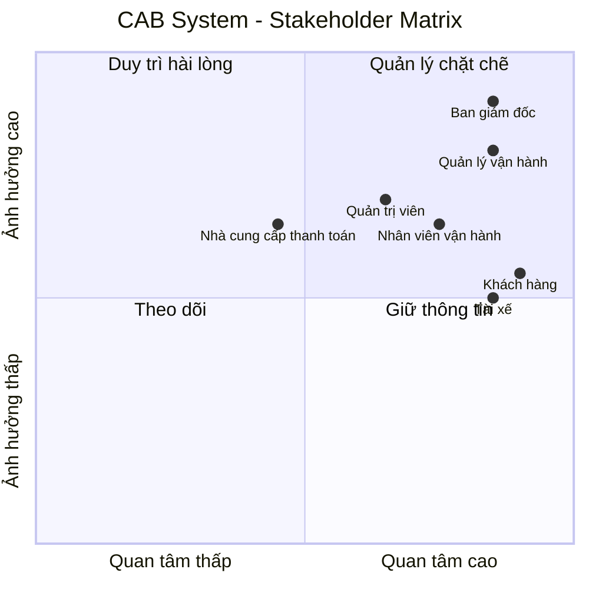
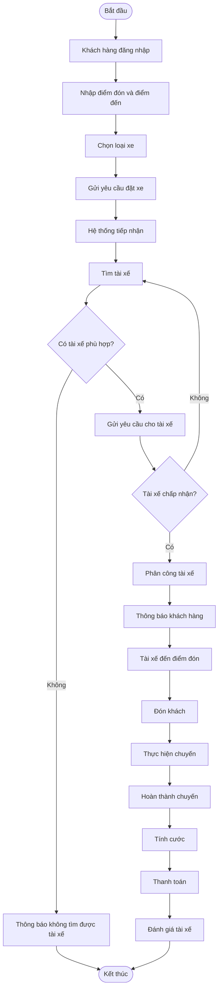
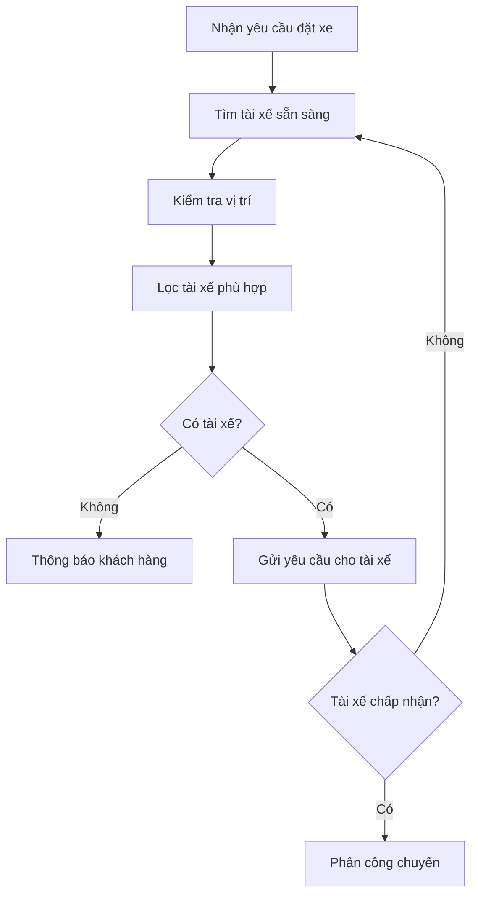
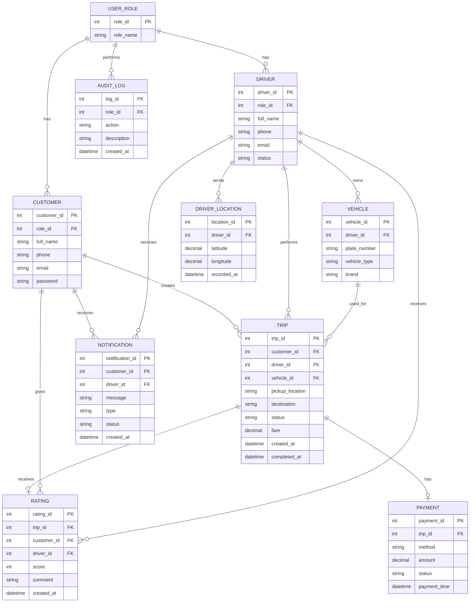
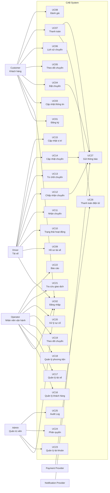
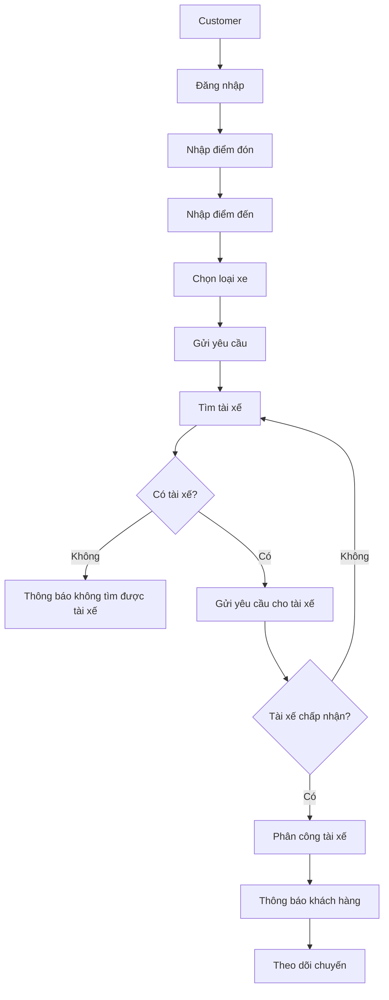

# SRS – CAB System

## Dự án xây dựng hệ thống CAB System – Nền tảng đặt xe

**Công ty:** ABC  
**Thời gian xây dựng:** 7 tuần  
**Phiên bản:** 1.0

---

# BƯỚC 1. PHÂN TÍCH YÊU CẦU SƠ KHỞI

## 1.1. Bối cảnh

Công ty ABC cung cấp dịch vụ đặt xe trực tuyến. Hiện tại khách hàng có thể liên hệ tổng đài hoặc sử dụng một ứng dụng đơn giản để yêu cầu xe.

Hệ thống hiện tại còn một số hạn chế:

- Phân công tài xế chủ yếu được thực hiện thủ công.
- Khách hàng khó theo dõi trạng thái chuyến đi.
- Thông tin thanh toán chưa được quản lý tập trung.
- Nhân viên vận hành khó quản lý số lượng lớn khách hàng và tài xế.
- Hệ thống khó mở rộng thêm chức năng mới.

Do đó, công ty ABC muốn xây dựng hệ thống CAB System mới.

## 1.2. Đối tượng sử dụng

Hệ thống có 3 nhóm người dùng chính:

- Khách hàng.
- Tài xế.
- Nhân viên vận hành.

Ngoài ra có:

- Quản trị viên.
- Nhà cung cấp thanh toán.
- Nhà cung cấp thông báo.

## 1.3. Nhu cầu của khách hàng

### Khách hàng

Khách hàng cần:

- Đăng ký tài khoản.
- Đăng nhập.
- Cập nhật thông tin cá nhân.
- Nhập điểm đón.
- Nhập điểm đến.
- Chọn loại xe.
- Đặt chuyến.
- Theo dõi trạng thái chuyến.
- Xem thông tin tài xế.
- Xem lịch sử chuyến.
- Thanh toán.
- Đánh giá tài xế.

### Tài xế

Tài xế cần:

- Đăng nhập.
- Cập nhật hồ sơ.
- Quản lý phương tiện.
- Bật/tắt trạng thái sẵn sàng.
- Nhận yêu cầu chuyến.
- Chấp nhận hoặc từ chối chuyến.
- Cập nhật trạng thái chuyến.
- Cập nhật vị trí.

### Nhân viên vận hành

Nhân viên vận hành cần:

- Quản lý khách hàng.
- Quản lý tài xế.
- Quản lý phương tiện.
- Theo dõi chuyến.
- Xử lý chuyến gặp sự cố.
- Tra cứu giao dịch.
- Xem báo cáo.

## 1.4. Các vấn đề cần làm rõ

Một số nội dung chưa được khách hàng xác định cụ thể:

- Công thức tính cước.
- Tiêu chí ưu tiên tài xế.
- Thời gian tài xế phải phản hồi.
- Chính sách hủy chuyến.
- Xử lý khi mất kết nối.
- Thời gian lưu trữ dữ liệu.
- Chính sách thanh toán thất bại.

Các nội dung này cần được xác nhận với khách hàng trước khi triển khai chi tiết.

---

# BƯỚC 2. XÁC ĐỊNH STAKEHOLDER

## 2.1. Danh sách Stakeholder

| Stakeholder | Vai trò |
|---|---|
| Khách hàng | Đặt xe, theo dõi chuyến, thanh toán và đánh giá tài xế. |
| Tài xế | Nhận và thực hiện chuyến xe. |
| Nhân viên vận hành | Theo dõi và quản lý hoạt động của hệ thống. |
| Quản lý vận hành | Quản lý hoạt động tài xế và chuyến đi. |
| Ban giám đốc | Đưa ra mục tiêu kinh doanh và theo dõi hiệu quả. |
| Quản trị viên | Quản lý tài khoản và quyền truy cập. |
| Nhà cung cấp thanh toán | Xử lý thanh toán điện tử. |
| Nhà cung cấp thông báo | Gửi thông báo cho khách hàng và tài xế. |
| Nhóm phát triển | Phân tích, xây dựng, kiểm thử và bảo trì hệ thống. |

## 2.2. Stakeholder Matrix

Ma trận dựa trên:

- Mức độ ảnh hưởng.
- Mức độ quan tâm.



---

# BƯỚC 3. BUSINESS GOAL – MỤC TIÊU NGHIỆP VỤ

Business Goal là mục tiêu doanh nghiệp muốn đạt được khi xây dựng CAB System.

| Mã | Business Goal | Diễn giải |
|---|---|---|
| BG01 | Tự động tìm tài xế | Giảm việc phân công tài xế thủ công. |
| BG02 | Hỗ trợ thanh toán | Cho phép thanh toán tiền mặt hoặc điện tử. |
| BG03 | Cải thiện trải nghiệm khách hàng | Cho phép đặt xe, theo dõi chuyến và nhận thông báo. |
| BG04 | Quản lý tập trung | Quản lý khách hàng, tài xế, xe, chuyến và giao dịch. |
| BG05 | Nâng cao hiệu quả vận hành | Hỗ trợ nhân viên theo dõi và xử lý chuyến. |
| BG06 | Cung cấp báo cáo | Theo dõi số chuyến, doanh thu và hiệu quả tài xế. |
| BG07 | Đảm bảo bảo mật | Bảo vệ tài khoản và dữ liệu quan trọng. |
| BG08 | Hỗ trợ mở rộng | Có thể bổ sung chức năng trong tương lai. |

### Ví dụ BG02

```text
BG02 – Hỗ trợ thanh toán

Hệ thống cho phép khách hàng:
- Thanh toán bằng tiền mặt.
- Thanh toán điện tử.

Đối với thanh toán điện tử:
- Hệ thống kết nối với nhà cung cấp thanh toán.
- CAB không lưu trực tiếp thông tin nhạy cảm của thẻ.
```

---

# BƯỚC 4. SCOPE – PHẠM VI HỆ THỐNG

## 4.1. Phạm vi thực hiện

| STT | Phạm vi |
|---|---|
| 1 | Quản lý khách hàng |
| 2 | Quản lý tài xế |
| 3 | Quản lý phương tiện |
| 4 | Đặt chuyến xe |
| 5 | Tìm tài xế |
| 6 | Phân công tài xế |
| 7 | Theo dõi chuyến |
| 8 | Cập nhật trạng thái chuyến |
| 9 | Quản lý vị trí tài xế |
| 10 | Tính cước |
| 11 | Thanh toán |
| 12 | Thông báo |
| 13 | Đánh giá tài xế |
| 14 | Quản lý vận hành |
| 15 | Tra cứu giao dịch |
| 16 | Báo cáo |
| 17 | Phân quyền |
| 18 | Ghi nhận thao tác |

## 4.2. Ngoài phạm vi

Các chức năng sau chưa thực hiện trong phiên bản cơ bản:

- Xây dựng hệ thống bản đồ riêng.
- Xây dựng hệ thống thanh toán riêng.
- Quản lý bảo dưỡng xe chuyên sâu.
- Quản lý lương tài xế.
- Hệ thống quảng cáo.
- Các dịch vụ không liên quan đến đặt xe.

Các chức năng này có thể được xem xét trong tương lai.

## 4.3. Xác nhận phạm vi

Business Analyst cần xác nhận với khách hàng:

- Phạm vi thực hiện.
- Phạm vi không thực hiện.
- Các chức năng ưu tiên.
- Các yêu cầu chưa rõ.

---

# BƯỚC 5. BUSINESS REQUIREMENT

Business Requirement mô tả những nghiệp vụ hệ thống cần hỗ trợ.

| Mã | Tên | Diễn giải |
|---|---|---|
| BR01 | Đặt chuyến xe | Cho phép khách hàng tạo yêu cầu đặt xe. |
| BR02 | Quản lý khách hàng | Đăng ký, đăng nhập và quản lý thông tin khách hàng. |
| BR03 | Quản lý tài xế | Quản lý tài khoản và trạng thái tài xế. |
| BR04 | Quản lý phương tiện | Quản lý thông tin phương tiện. |
| BR05 | Tìm tài xế | Tự động tìm tài xế phù hợp. |
| BR06 | Phân công tài xế | Gửi yêu cầu và xử lý phản hồi của tài xế. |
| BR07 | Theo dõi chuyến | Khách hàng theo dõi trạng thái chuyến. |
| BR08 | Thực hiện chuyến | Tài xế cập nhật trạng thái chuyến. |
| BR09 | Quản lý vị trí | Ghi nhận vị trí tài xế. |
| BR10 | Tính cước | Xác định số tiền khách hàng phải trả. |
| BR11 | Thanh toán | Hỗ trợ tiền mặt và thanh toán điện tử. |
| BR12 | Xử lý thanh toán lỗi | Xử lý thanh toán điện tử thất bại. |
| BR13 | Thông báo | Gửi thông báo cho khách hàng và tài xế. |
| BR14 | Đánh giá tài xế | Cho phép khách hàng đánh giá tài xế. |
| BR15 | Quản lý vận hành | Nhân viên quản lý hoạt động hệ thống. |
| BR16 | Xử lý sự cố | Xử lý các chuyến gặp vấn đề. |
| BR17 | Quản lý giao dịch | Tra cứu lịch sử giao dịch. |
| BR18 | Phân quyền | Kiểm soát quyền người dùng. |
| BR19 | Báo cáo | Cung cấp báo cáo hoạt động. |
| BR20 | Ghi nhận thao tác | Lưu các thao tác quan trọng. |

## 5.1. Liên kết BG và BR

| Business Goal | Business Requirement |
|---|---|
| BG01 | BR05, BR06 |
| BG02 | BR10, BR11, BR12 |
| BG03 | BR01, BR07, BR13, BR14 |
| BG04 | BR02, BR03, BR04, BR17 |
| BG05 | BR15, BR16 |
| BG06 | BR17, BR19 |
| BG07 | BR18, BR20 |
| BG08 | Các yêu cầu thiết kế và mở rộng ở giai đoạn sau |

---

# BƯỚC 6. BUSINESS PROCESS

## 6.1. Quy trình đặt xe

Quy trình chính:

1. Khách hàng đăng nhập.
2. Nhập điểm đón.
3. Nhập điểm đến.
4. Chọn loại xe.
5. Gửi yêu cầu đặt xe.
6. Hệ thống tiếp nhận.
7. Hệ thống tìm tài xế.
8. Gửi yêu cầu cho tài xế.
9. Tài xế chấp nhận hoặc từ chối.
10. Nếu từ chối, hệ thống tìm tài xế khác.
11. Nếu chấp nhận, hệ thống phân công.
12. Tài xế đến điểm đón.
13. Đón khách.
14. Thực hiện chuyến.
15. Hoàn thành chuyến.
16. Tính cước.
17. Thanh toán.
18. Đánh giá tài xế.

## 6.2. Business Process Diagram



## 6.3. Quy trình tìm tài xế



> Tiêu chí ưu tiên tài xế và thời gian phản hồi cần được khách hàng xác nhận.

---

# BƯỚC 7. FUNCTIONAL REQUIREMENT

Functional Requirement là các chức năng cụ thể mà hệ thống phải thực hiện.

## 7.1. BR01 – Đặt chuyến

| Mã | Tên | Diễn giải |
|---|---|---|
| FR01.01 | Nhập điểm đón | Cho phép khách hàng nhập điểm đón. |
| FR01.02 | Nhập điểm đến | Cho phép khách hàng nhập điểm đến. |
| FR01.03 | Chọn loại xe | Cho phép chọn loại xe. |
| FR01.04 | Gửi yêu cầu | Cho phép gửi yêu cầu đặt xe. |
| FR01.05 | Kiểm tra yêu cầu | Kiểm tra thông tin đặt xe. |
| FR01.06 | Tạo chuyến | Tạo và lưu thông tin chuyến. |

## 7.2. BR02 – Quản lý khách hàng

| Mã | Tên | Diễn giải |
|---|---|---|
| FR02.01 | Đăng ký | Khách hàng tạo tài khoản. |
| FR02.02 | Đăng nhập | Khách hàng đăng nhập. |
| FR02.03 | Cập nhật thông tin | Cập nhật thông tin cá nhân. |

## 7.3. BR03 – Quản lý tài xế

| Mã | Tên | Diễn giải |
|---|---|---|
| FR03.01 | Quản lý hồ sơ | Lưu thông tin tài xế. |
| FR03.02 | Cập nhật trạng thái | Bật/tắt trạng thái sẵn sàng. |
| FR03.03 | Quản lý tài khoản | Quản lý tài khoản tài xế. |

## 7.4. BR04 – Quản lý phương tiện

| Mã | Tên | Diễn giải |
|---|---|---|
| FR04.01 | Thêm phương tiện | Thêm thông tin xe. |
| FR04.02 | Cập nhật phương tiện | Cập nhật thông tin xe. |

## 7.5. BR05 – Tìm tài xế

| Mã | Tên | Diễn giải |
|---|---|---|
| FR05.01 | Tìm tài xế sẵn sàng | Tìm tài xế đang sẵn sàng. |
| FR05.02 | Kiểm tra vị trí | Kiểm tra vị trí tài xế. |
| FR05.03 | Lọc tài xế | Lọc tài xế phù hợp. |
| FR05.04 | Ưu tiên tài xế | Ưu tiên theo tiêu chí được xác nhận. |

## 7.6. BR06 – Phân công tài xế

| Mã | Tên | Diễn giải |
|---|---|---|
| FR06.01 | Gửi yêu cầu | Gửi yêu cầu chuyến. |
| FR06.02 | Chấp nhận | Ghi nhận tài xế chấp nhận. |
| FR06.03 | Từ chối | Ghi nhận tài xế từ chối. |
| FR06.04 | Không phản hồi | Xử lý khi tài xế không phản hồi. |
| FR06.05 | Tìm tài xế khác | Tiếp tục tìm tài xế khác. |
| FR06.06 | Thông báo thất bại | Thông báo không tìm được tài xế. |

## 7.7. BR07 – Theo dõi chuyến

| Mã | Tên | Diễn giải |
|---|---|---|
| FR07.01 | Xem trạng thái | Xem trạng thái chuyến. |
| FR07.02 | Xem tài xế | Xem thông tin tài xế. |
| FR07.03 | Theo dõi vị trí | Theo dõi vị trí tài xế. |

## 7.8. BR08 – Thực hiện chuyến

| Mã | Tên | Diễn giải |
|---|---|---|
| FR08.01 | Đã đến | Tài xế cập nhật đã đến. |
| FR08.02 | Đã đón khách | Tài xế cập nhật đã đón khách. |
| FR08.03 | Đang di chuyển | Tài xế cập nhật đang di chuyển. |
| FR08.04 | Hoàn thành | Tài xế hoàn thành chuyến. |

## 7.9. BR09 – Quản lý vị trí

| Mã | Tên | Diễn giải |
|---|---|---|
| FR09.01 | Ghi nhận vị trí | Ghi nhận vị trí tài xế. |
| FR09.02 | Cập nhật vị trí | Cập nhật vị trí mới. |

## 7.10. BR10 – Tính cước

| Mã | Tên | Diễn giải |
|---|---|---|
| FR10.01 | Tính cước | Tính số tiền cần trả. |
| FR10.02 | Xác định dịch vụ | Xác định loại dịch vụ. |
| FR10.03 | Lưu cước | Lưu thông tin cước. |

## 7.11. BR11 – Thanh toán

| Mã | Tên | Diễn giải |
|---|---|---|
| FR11.01 | Chọn phương thức | Chọn phương thức thanh toán. |
| FR11.02 | Tiền mặt | Hỗ trợ tiền mặt. |
| FR11.03 | Thanh toán điện tử | Hỗ trợ thanh toán điện tử. |
| FR11.04 | Nhận kết quả | Nhận kết quả giao dịch. |

## 7.12. BR12 – Thanh toán lỗi

| Mã | Tên | Diễn giải |
|---|---|---|
| FR12.01 | Ghi nhận lỗi | Ghi nhận giao dịch lỗi. |
| FR12.02 | Thông báo lỗi | Thông báo khách hàng. |
| FR12.03 | Thanh toán lại | Cho phép xử lý lại theo chính sách. |

## 7.13. BR13 – Thông báo

| Mã | Tên | Diễn giải |
|---|---|---|
| FR13.01 | Thông báo đặt xe | Thông báo khi yêu cầu được tiếp nhận. |
| FR13.02 | Thông báo nhận chuyến | Thông báo khi có tài xế nhận chuyến. |
| FR13.03 | Thông báo đến | Thông báo khi tài xế đến. |
| FR13.04 | Thông báo hoàn thành | Thông báo khi chuyến hoàn thành. |
| FR13.05 | Thông báo thanh toán | Thông báo kết quả thanh toán. |

## 7.14. BR14 – Đánh giá

| Mã | Tên | Diễn giải |
|---|---|---|
| FR14.01 | Đánh giá tài xế | Khách hàng đánh giá tài xế. |
| FR14.02 | Lưu đánh giá | Lưu đánh giá vào hệ thống. |

## 7.15. BR15 – Quản lý vận hành

| Mã | Tên | Diễn giải |
|---|---|---|
| FR15.01 | Quản lý khách hàng | Nhân viên quản lý khách hàng. |
| FR15.02 | Quản lý tài xế | Nhân viên quản lý tài xế. |
| FR15.03 | Quản lý phương tiện | Nhân viên quản lý phương tiện. |
| FR15.04 | Theo dõi chuyến | Nhân viên theo dõi chuyến. |

## 7.16. BR16 – Xử lý sự cố

| Mã | Tên | Diễn giải |
|---|---|---|
| FR16.01 | Xem chuyến lỗi | Xem chuyến gặp vấn đề. |
| FR16.02 | Xử lý chuyến lỗi | Hỗ trợ xử lý chuyến lỗi. |

## 7.17. BR17 – Giao dịch

| Mã | Tên | Diễn giải |
|---|---|---|
| FR17.01 | Tra cứu giao dịch | Tra cứu giao dịch. |
| FR17.02 | Xem trạng thái | Xem trạng thái giao dịch. |

## 7.18. BR18 – Phân quyền

| Mã | Tên | Diễn giải |
|---|---|---|
| FR18.01 | Xác thực | Xác thực người dùng. |
| FR18.02 | Phân quyền | Kiểm soát quyền theo vai trò. |
| FR18.03 | Kiểm soát quản trị | Hạn chế thao tác nhạy cảm. |

## 7.19. BR19 – Báo cáo

| Mã | Tên | Diễn giải |
|---|---|---|
| FR19.01 | Báo cáo chuyến | Thống kê số lượng chuyến. |
| FR19.02 | Báo cáo doanh thu | Thống kê doanh thu. |
| FR19.03 | Báo cáo hoàn thành | Thống kê tỷ lệ hoàn thành. |
| FR19.04 | Báo cáo hủy | Thống kê tỷ lệ hủy. |
| FR19.05 | Báo cáo tài xế | Thống kê hiệu quả tài xế. |

## 7.20. BR20 – Ghi nhận thao tác

| Mã | Tên | Diễn giải |
|---|---|---|
| FR20.01 | Ghi log | Ghi nhận thao tác quan trọng. |
| FR20.02 | Tra cứu log | Cho phép người có quyền tra cứu log. |

---

# BƯỚC 8. BUSINESS RULE VÀ BUSINESS EXCEPTION

## 8.1. Business Rule

Business Rule là các quy tắc nghiệp vụ mà hệ thống phải tuân theo.

| Mã | Business Rule | Diễn giải |
|---|---|---|
| BRULE01 | Người dùng phải đăng nhập | Các chức năng yêu cầu tài khoản phải xác thực trước. |
| BRULE02 | Tài xế phải sẵn sàng | Chỉ tài xế ở trạng thái sẵn sàng mới được tìm để nhận chuyến. |
| BRULE03 | Một chuyến chỉ có một tài xế | Một chuyến không được phân công đồng thời cho nhiều tài xế. |
| BRULE04 | Tài xế có thể từ chối | Khi tài xế từ chối, hệ thống tiếp tục tìm tài xế khác. |
| BRULE05 | Không tìm được tài xế | Hệ thống phải thông báo cho khách hàng. |
| BRULE06 | Chỉ chuyến hoàn thành mới tính cước cuối cùng | Cước cuối cùng được xác định sau khi chuyến hoàn thành. |
| BRULE07 | Hỗ trợ hai phương thức thanh toán | Tiền mặt và thanh toán điện tử. |
| BRULE08 | Không lưu thông tin thẻ nhạy cảm | CAB không lưu trực tiếp dữ liệu nhạy cảm của thẻ. |
| BRULE09 | Chỉ được đánh giá sau chuyến | Customer chỉ được đánh giá chuyến đã hoàn thành. |
| BRULE10 | Phân quyền | Người dùng chỉ được thực hiện chức năng phù hợp với quyền. |
| BRULE11 | Ghi nhận thao tác quan trọng | Các thao tác quản trị phải được ghi log. |

> Một số Business Rule như công thức tính cước, thời gian phản hồi tài xế và chính sách hủy cần được khách hàng xác nhận.

## 8.2. Business Exception

Business Exception là các trường hợp bất thường cần được hệ thống xử lý.

| Mã | Exception | Cách xử lý |
|---|---|---|
| EX01 | Không tìm được tài xế | Thông báo cho khách hàng. |
| EX02 | Tài xế từ chối | Tìm tài xế khác. |
| EX03 | Tài xế không phản hồi | Sau thời gian quy định, tìm tài xế khác. |
| EX04 | Thanh toán thất bại | Thông báo và cho phép xử lý lại theo chính sách. |
| EX05 | Mất kết nối | Lưu trạng thái phù hợp và xử lý lại khi có kết nối. |
| EX06 | Không lấy được vị trí | Sử dụng vị trí gần nhất nếu có hoặc thông báo lỗi. |
| EX07 | Người dùng không có quyền | Từ chối thao tác. |
| EX08 | Dữ liệu không hợp lệ | Thông báo lỗi và yêu cầu nhập lại. |

---

# BƯỚC 9. DATA MODEL VÀ ERD

## 9.1. Các thực thể chính

Hệ thống CAB System có các thực thể cơ bản:

| Entity | Diễn giải |
|---|---|
| Customer | Thông tin khách hàng. |
| Driver | Thông tin tài xế. |
| Vehicle | Thông tin phương tiện. |
| Trip | Thông tin chuyến xe. |
| Payment | Thông tin thanh toán. |
| Rating | Đánh giá tài xế. |
| Notification | Thông báo. |
| DriverLocation | Vị trí tài xế. |
| AuditLog | Lịch sử thao tác. |
| UserRole | Vai trò người dùng. |

## 9.2. ERD



---

# BƯỚC 10. NON-FUNCTIONAL REQUIREMENTS

Non-Functional Requirement mô tả hệ thống phải hoạt động như thế nào.

## 10.1. Performance

| Mã | Yêu cầu |
|---|---|
| NFR01 | Hệ thống phải phản hồi các thao tác thông thường trong thời gian hợp lý. |
| NFR02 | Hệ thống phải hỗ trợ nhiều khách hàng và tài xế sử dụng đồng thời. |
| NFR03 | Chức năng tìm tài xế phải xử lý tự động. |

## 10.2. Availability

| Mã | Yêu cầu |
|---|---|
| NFR04 | Hệ thống phải hoạt động ổn định trong thời gian cao điểm. |
| NFR05 | Lỗi thanh toán không được làm dừng chức năng đặt xe. |
| NFR06 | Lỗi thông báo không được làm dừng toàn bộ hệ thống. |

## 10.3. Security

| Mã | Yêu cầu |
|---|---|
| NFR07 | Người dùng phải được xác thực trước khi sử dụng chức năng yêu cầu tài khoản. |
| NFR08 | Chức năng quản trị phải được phân quyền. |
| NFR09 | Mật khẩu phải được bảo vệ an toàn. |
| NFR10 | Thông tin cá nhân phải được bảo vệ. |
| NFR11 | Dữ liệu giao dịch phải được bảo vệ. |
| NFR12 | Các thao tác quan trọng phải được ghi Audit Log. |

## 10.4. Scalability

| Mã | Yêu cầu |
|---|---|
| NFR13 | Hệ thống có khả năng mở rộng khi số lượng người dùng tăng. |
| NFR14 | Các thành phần có thể mở rộng độc lập khi cần thiết. |
| NFR15 | Có thể bổ sung thêm loại dịch vụ trong tương lai. |

## 10.5. Maintainability

| Mã | Yêu cầu |
|---|---|
| NFR16 | Hệ thống phải dễ bảo trì. |
| NFR17 | Có thể thay đổi nhà cung cấp thanh toán mà không ảnh hưởng toàn bộ hệ thống. |
| NFR18 | Có thể bổ sung nhà cung cấp thông báo mới. |

## 10.6. Reliability

| Mã | Yêu cầu |
|---|---|
| NFR19 | Hệ thống phải xử lý lỗi một cách an toàn. |
| NFR20 | Dữ liệu chuyến và giao dịch phải được lưu trữ chính xác. |
| NFR21 | Khi xảy ra lỗi, hệ thống phải có khả năng khôi phục phù hợp. |

## 10.7. Usability

| Mã | Yêu cầu |
|---|---|
| NFR22 | Giao diện phải dễ sử dụng. |
| NFR23 | Khách hàng dễ dàng thực hiện thao tác đặt xe. |
| NFR24 | Tài xế dễ dàng nhận và cập nhật chuyến. |
| NFR25 | Nhân viên vận hành dễ dàng theo dõi chuyến. |

---

# BƯỚC 11. USE CASE

## 11.1. Actor

| Actor | Vai trò |
|---|---|
| Customer | Khách hàng đặt và quản lý chuyến. |
| Driver | Tài xế nhận và thực hiện chuyến. |
| Operator | Nhân viên vận hành. |
| Admin | Quản trị viên. |
| Payment Provider | Nhà cung cấp thanh toán. |
| Notification Provider | Nhà cung cấp thông báo. |

## 11.2. Danh sách Use Case

| Mã | Use Case | Actor |
|---|---|---|
| UC01 | Đăng ký tài khoản | Customer |
| UC02 | Đăng nhập | Customer, Driver, Operator, Admin |
| UC03 | Cập nhật thông tin | Customer |
| UC04 | Đặt chuyến xe | Customer |
| UC05 | Theo dõi chuyến | Customer |
| UC06 | Xem lịch sử chuyến | Customer |
| UC07 | Thanh toán chuyến | Customer |
| UC08 | Đánh giá tài xế | Customer |
| UC09 | Cập nhật hồ sơ tài xế | Driver |
| UC10 | Cập nhật trạng thái hoạt động | Driver |
| UC11 | Nhận yêu cầu chuyến | Driver |
| UC12 | Chấp nhận chuyến | Driver |
| UC13 | Từ chối chuyến | Driver |
| UC14 | Cập nhật trạng thái chuyến | Driver |
| UC15 | Cập nhật vị trí | Driver |
| UC16 | Quản lý khách hàng | Operator |
| UC17 | Quản lý tài xế | Operator |
| UC18 | Quản lý phương tiện | Operator |
| UC19 | Theo dõi chuyến | Operator |
| UC20 | Xử lý sự cố | Operator |
| UC21 | Tra cứu giao dịch | Operator |
| UC22 | Xem báo cáo | Operator |
| UC23 | Quản lý tài khoản | Admin |
| UC24 | Phân quyền | Admin |
| UC25 | Xem Audit Log | Admin |
| UC26 | Thanh toán điện tử | Payment Provider |
| UC27 | Gửi thông báo | Notification Provider |

## 11.3. Use Case Diagram



## 11.4. Use Case chính – Đặt chuyến



---

# BƯỚC 12. USE CASE SPECIFICATION

## 12.1. UC01 – Đăng ký tài khoản

| Thuộc tính | Nội dung |
|---|---|
| Mã | UC01 |
| Tên | Đăng ký tài khoản |
| Actor | Customer |
| Mục tiêu | Tạo tài khoản |
| Điều kiện trước | Customer chưa có tài khoản |
| Điều kiện sau | Tài khoản được tạo |

### Main Flow

1. Customer chọn đăng ký.
2. Hệ thống hiển thị form.
3. Customer nhập thông tin.
4. Customer gửi thông tin.
5. Hệ thống kiểm tra dữ liệu.
6. Hệ thống tạo tài khoản.
7. Hệ thống thông báo thành công.

### Alternative Flow

- Email đã tồn tại → Thông báo lỗi.
- Dữ liệu không hợp lệ → Yêu cầu nhập lại.

---

## 12.2. UC02 – Đăng nhập

| Thuộc tính | Nội dung |
|---|---|
| Mã | UC02 |
| Tên | Đăng nhập |
| Actor | Customer / Driver / Operator / Admin |
| Mục tiêu | Truy cập hệ thống |
| Điều kiện trước | Có tài khoản |
| Điều kiện sau | Đăng nhập thành công |

### Main Flow

1. Người dùng mở chức năng đăng nhập.
2. Nhập tài khoản.
3. Nhập mật khẩu.
4. Chọn đăng nhập.
5. Hệ thống kiểm tra.
6. Hệ thống xác thực.
7. Cho phép truy cập.

### Alternative Flow

- Sai mật khẩu → Thông báo lỗi.
- Tài khoản không tồn tại → Thông báo lỗi.
- Tài khoản bị khóa → Không cho phép truy cập.

---

## 12.3. UC04 – Đặt chuyến xe

| Thuộc tính | Nội dung |
|---|---|
| Mã | UC04 |
| Tên | Đặt chuyến xe |
| Actor | Customer |
| Mục tiêu | Tạo yêu cầu đặt xe |
| Điều kiện trước | Customer đã đăng nhập |
| Điều kiện sau | Yêu cầu chuyến được tạo |

### Main Flow

1. Customer chọn đặt xe.
2. Nhập điểm đón.
3. Nhập điểm đến.
4. Chọn loại xe.
5. Xác nhận đặt xe.
6. Hệ thống kiểm tra thông tin.
7. Hệ thống tạo chuyến.
8. Hệ thống bắt đầu tìm tài xế.
9. Hệ thống gửi yêu cầu cho tài xế phù hợp.
10. Tài xế chấp nhận.
11. Hệ thống phân công tài xế.
12. Hệ thống thông báo cho Customer.

### Alternative Flow

**A1 – Dữ liệu không hợp lệ**

1. Hệ thống phát hiện lỗi.
2. Thông báo lỗi.
3. Customer nhập lại.

**A2 – Không tìm được tài xế**

1. Hệ thống không tìm được tài xế.
2. Chuyển chuyến sang trạng thái `NO_DRIVER_FOUND`.
3. Thông báo Customer.

**A3 – Tài xế từ chối**

1. Tài xế từ chối.
2. Hệ thống ghi nhận.
3. Hệ thống tìm tài xế khác.

---

## 12.4. UC05 – Theo dõi chuyến

| Thuộc tính | Nội dung |
|---|---|
| Mã | UC05 |
| Tên | Theo dõi chuyến |
| Actor | Customer |
| Mục tiêu | Theo dõi trạng thái chuyến |
| Điều kiện trước | Có chuyến đang hoạt động |
| Điều kiện sau | Xem được thông tin chuyến |

### Main Flow

1. Customer mở chuyến.
2. Hệ thống hiển thị trạng thái.
3. Hiển thị thông tin tài xế.
4. Hiển thị phương tiện.
5. Hiển thị vị trí tài xế nếu có.
6. Cập nhật khi trạng thái thay đổi.

### Alternative Flow

- Không có vị trí mới → Hiển thị vị trí gần nhất nếu có.

---

## 12.5. UC11 – Nhận yêu cầu chuyến

| Thuộc tính | Nội dung |
|---|---|
| Mã | UC11 |
| Tên | Nhận yêu cầu chuyến |
| Actor | Driver |
| Mục tiêu | Nhận thông tin chuyến mới |
| Điều kiện trước | Driver đang sẵn sàng |
| Điều kiện sau | Driver nhận được yêu cầu |

### Main Flow

1. Driver chuyển sang trạng thái `AVAILABLE`.
2. Hệ thống tìm Driver phù hợp.
3. Hệ thống gửi thông báo.
4. Driver xem thông tin chuyến.
5. Driver quyết định.

### Alternative Flow

- Không phản hồi → Hệ thống tìm tài xế khác.
- Từ chối → Hệ thống tìm tài xế khác.

---

## 12.6. UC12 – Chấp nhận chuyến

| Thuộc tính | Nội dung |
|---|---|
| Mã | UC12 |
| Tên | Chấp nhận chuyến |
| Actor | Driver |
| Mục tiêu | Nhận thực hiện chuyến |
| Điều kiện trước | Driver nhận được yêu cầu |
| Điều kiện sau | Driver được phân công |

### Main Flow

1. Driver xem yêu cầu.
2. Chọn chấp nhận.
3. Hệ thống kiểm tra chuyến.
4. Hệ thống phân công Driver.
5. Cập nhật trạng thái chuyến.
6. Thông báo Customer.

### Alternative Flow

- Chuyến đã được nhận bởi tài xế khác → Thông báo chuyến không còn khả dụng.

---

## 12.7. UC13 – Từ chối chuyến

| Thuộc tính | Nội dung |
|---|---|
| Mã | UC13 |
| Tên | Từ chối chuyến |
| Actor | Driver |
| Mục tiêu | Từ chối chuyến |
| Điều kiện trước | Driver nhận được yêu cầu |
| Điều kiện sau | Hệ thống tìm tài xế khác |

### Main Flow

1. Driver xem yêu cầu.
2. Chọn từ chối.
3. Hệ thống ghi nhận.
4. Hệ thống tìm tài xế khác.

---

## 12.8. UC14 – Cập nhật trạng thái chuyến

| Thuộc tính | Nội dung |
|---|---|
| Mã | UC14 |
| Tên | Cập nhật trạng thái chuyến |
| Actor | Driver |
| Mục tiêu | Cập nhật tiến trình chuyến |
| Điều kiện trước | Driver đã được phân công |
| Điều kiện sau | Trạng thái chuyến được cập nhật |

### Main Flow

Tài xế cập nhật:

```text
DRIVER_ASSIGNED
        ↓
DRIVER_ARRIVING
        ↓
DRIVER_ARRIVED
        ↓
PASSENGER_PICKED_UP
        ↓
IN_PROGRESS
        ↓
COMPLETED
```

Khi trạng thái thay đổi, hệ thống gửi thông báo cho Customer.

---

## 12.9. UC15 – Cập nhật vị trí

| Thuộc tính | Nội dung |
|---|---|
| Mã | UC15 |
| Tên | Cập nhật vị trí |
| Actor | Driver |
| Mục tiêu | Cập nhật vị trí hiện tại |
| Điều kiện trước | Driver đang hoạt động |
| Điều kiện sau | Vị trí được lưu |

### Main Flow

1. Driver bật vị trí.
2. Hệ thống nhận vị trí.
3. Hệ thống lưu vị trí.
4. Hệ thống cập nhật vị trí mới.
5. Customer có thể xem vị trí.

---

## 12.10. UC07 – Thanh toán chuyến

| Thuộc tính | Nội dung |
|---|---|
| Mã | UC07 |
| Tên | Thanh toán chuyến |
| Actor | Customer |
| Actor phụ | Payment Provider |
| Mục tiêu | Thanh toán tiền chuyến |
| Điều kiện trước | Chuyến đã hoàn thành |
| Điều kiện sau | Thanh toán được ghi nhận |

### Main Flow

1. Chuyến hoàn thành.
2. Hệ thống tính cước.
3. Hiển thị số tiền.
4. Customer chọn phương thức.
5. Nếu tiền mặt, hệ thống ghi nhận tiền mặt.
6. Nếu điện tử, hệ thống gửi yêu cầu Payment Provider.
7. Payment Provider xử lý.
8. Trả kết quả.
9. Hệ thống lưu kết quả.
10. Thông báo Customer.

### Alternative Flow

**A1 – Thanh toán thất bại**

1. Payment Provider trả kết quả thất bại.
2. Hệ thống ghi nhận lỗi.
3. Thông báo Customer.
4. Cho phép xử lý lại theo chính sách.

**A2 – Mất kết nối**

1. Không nhận được kết quả.
2. Ghi nhận trạng thái chờ.
3. Kiểm tra lại giao dịch sau.

---

## 12.11. UC08 – Đánh giá tài xế

| Thuộc tính | Nội dung |
|---|---|
| Mã | UC08 |
| Tên | Đánh giá tài xế |
| Actor | Customer |
| Mục tiêu | Đánh giá chuyến |
| Điều kiện trước | Chuyến đã hoàn thành |
| Điều kiện sau | Đánh giá được lưu |

### Main Flow

1. Customer mở lịch sử chuyến.
2. Chọn chuyến hoàn thành.
3. Chọn số điểm.
4. Nhập nhận xét nếu muốn.
5. Gửi đánh giá.
6. Hệ thống kiểm tra.
7. Lưu đánh giá.

### Alternative Flow

- Chuyến chưa hoàn thành → Không cho phép đánh giá.
- Đã đánh giá → Không cho phép đánh giá lại nếu chính sách không cho phép.

---

## 12.12. UC19 – Theo dõi chuyến – Operator

| Thuộc tính | Nội dung |
|---|---|
| Mã | UC19 |
| Tên | Theo dõi chuyến |
| Actor | Operator |
| Mục tiêu | Theo dõi chuyến đang hoạt động |
| Điều kiện trước | Operator đã đăng nhập |
| Điều kiện sau | Xem được thông tin chuyến |

### Main Flow

1. Operator đăng nhập.
2. Chọn quản lý chuyến.
3. Hệ thống hiển thị danh sách chuyến.
4. Operator chọn chuyến.
5. Hệ thống hiển thị thông tin.
6. Operator xem trạng thái và tài xế.
7. Nếu có sự cố, Operator xử lý theo quyền.

---

## 12.13. UC20 – Xử lý sự cố

| Thuộc tính | Nội dung |
|---|---|
| Mã | UC20 |
| Tên | Xử lý sự cố |
| Actor | Operator |
| Mục tiêu | Xử lý chuyến gặp vấn đề |
| Điều kiện trước | Operator có quyền |
| Điều kiện sau | Sự cố được ghi nhận |

### Main Flow

1. Operator xem danh sách chuyến.
2. Chọn chuyến có sự cố.
3. Xem thông tin.
4. Xác định vấn đề.
5. Thực hiện thao tác được phép.
6. Hệ thống ghi log.
7. Cập nhật kết quả.

---

## 12.14. UC22 – Xem báo cáo

| Thuộc tính | Nội dung |
|---|---|
| Mã | UC22 |
| Tên | Xem báo cáo |
| Actor | Operator |
| Mục tiêu | Theo dõi hiệu quả hoạt động |
| Điều kiện trước | Operator có quyền |
| Điều kiện sau | Báo cáo được hiển thị |

### Main Flow

1. Operator mở báo cáo.
2. Chọn khoảng thời gian.
3. Chọn loại báo cáo.
4. Hệ thống lấy dữ liệu.
5. Hệ thống hiển thị báo cáo.

Các báo cáo:

- Số lượng chuyến.
- Doanh thu.
- Tỷ lệ hoàn thành.
- Tỷ lệ hủy.
- Hiệu quả tài xế.

---

## 12.15. UC24 – Phân quyền

| Thuộc tính | Nội dung |
|---|---|
| Mã | UC24 |
| Tên | Phân quyền |
| Actor | Admin |
| Mục tiêu | Kiểm soát quyền truy cập |
| Điều kiện trước | Admin đã đăng nhập |
| Điều kiện sau | Quyền được cập nhật |

### Main Flow

1. Admin đăng nhập.
2. Chọn quản lý quyền.
3. Chọn người dùng.
4. Chọn vai trò.
5. Hệ thống kiểm tra quyền.
6. Hệ thống cập nhật vai trò.
7. Hệ thống ghi Audit Log.

---


# 13. Acceptance Criteria – Tiêu chí chấp nhận

## 13.1. Khái niệm

Acceptance Criteria (AC) là tập hợp các điều kiện mà một chức năng phải đáp ứng để được xem là hoàn thành và có thể nghiệm thu.

Mỗi Acceptance Criteria cần mô tả rõ:

- Chức năng phải làm được gì.
- Điều kiện để thực hiện.
- Kết quả mong đợi.
- Trường hợp lỗi hoặc ngoại lệ nếu có.

Acceptance Criteria được sử dụng để:

- Business Analyst xác nhận yêu cầu với khách hàng.
- Developer biết chức năng cần thực hiện như thế nào.
- Tester dùng làm cơ sở kiểm thử.
- Khách hàng dùng để nghiệm thu chức năng.

---

# 13.2. Acceptance Criteria cho chức năng đặt chuyến

## AC01 – Đặt chuyến thành công

**Mã:** AC01  
**Chức năng:** Đặt chuyến xe  
**Liên quan:** BR01, FR01.01 – FR01.06

### Điều kiện

- Khách hàng đã đăng nhập.
- Khách hàng nhập điểm đón.
- Khách hàng nhập điểm đến.
- Khách hàng chọn loại xe.

### Tiêu chí chấp nhận

- Hệ thống phải kiểm tra đầy đủ thông tin đặt xe.
- Nếu thông tin hợp lệ, hệ thống tạo một chuyến mới.
- Chuyến mới có trạng thái "Đang tìm tài xế".
- Hệ thống lưu thông tin điểm đón, điểm đến và loại xe.
- Hệ thống bắt đầu quá trình tìm tài xế.
- Khách hàng nhận được thông báo yêu cầu đã được tiếp nhận.

---

## AC02 – Đặt chuyến thiếu thông tin

**Mã:** AC02  
**Chức năng:** Đặt chuyến xe

### Tiêu chí chấp nhận

- Nếu khách hàng chưa nhập điểm đón, hệ thống phải thông báo lỗi.
- Nếu khách hàng chưa nhập điểm đến, hệ thống phải thông báo lỗi.
- Nếu khách hàng chưa chọn loại xe, hệ thống phải thông báo lỗi.
- Hệ thống không được tạo chuyến khi thông tin không đầy đủ.

---

# 13.3. Acceptance Criteria cho chức năng tìm tài xế

## AC03 – Tìm được tài xế

**Mã:** AC03  
**Chức năng:** Tự động tìm tài xế  
**Liên quan:** BR05, FR05.01 – FR05.04

### Điều kiện

- Có yêu cầu đặt xe hợp lệ.
- Có tài xế đang ở trạng thái sẵn sàng.
- Tài xế phù hợp với loại xe được yêu cầu.

### Tiêu chí chấp nhận

- Hệ thống phải tìm các tài xế phù hợp.
- Hệ thống phải xem xét vị trí của tài xế.
- Hệ thống phải lựa chọn tài xế theo tiêu chí ưu tiên đã được doanh nghiệp xác nhận.
- Hệ thống gửi yêu cầu chuyến đến tài xế được lựa chọn.
- Trạng thái chuyến được cập nhật phù hợp.

---

## AC04 – Tài xế từ chối chuyến

**Mã:** AC04  
**Chức năng:** Xử lý tài xế từ chối chuyến

### Tiêu chí chấp nhận

- Hệ thống phải ghi nhận tài xế đã từ chối chuyến.
- Hệ thống không được gán chuyến đó cho tài xế đã từ chối.
- Hệ thống phải tiếp tục tìm tài xế phù hợp khác.
- Khách hàng không cần tạo lại yêu cầu đặt xe.

---

## AC05 – Tài xế không phản hồi

**Mã:** AC05  
**Chức năng:** Xử lý tài xế không phản hồi

### Tiêu chí chấp nhận

- Hệ thống phải xác định tài xế không phản hồi sau thời gian quy định.
- Hệ thống tiếp tục tìm tài xế khác.
- Chuyến vẫn được giữ ở trạng thái đang tìm tài xế.
- Thời gian phản hồi cụ thể phải được xác nhận với khách hàng.

---

## AC06 – Không tìm được tài xế

**Mã:** AC06  
**Chức năng:** Không tìm được tài xế

### Tiêu chí chấp nhận

- Hệ thống phải xác định khi không còn tài xế phù hợp.
- Hệ thống cập nhật trạng thái chuyến thành "Không tìm được tài xế".
- Hệ thống phải thông báo rõ ràng cho khách hàng.
- Hệ thống không được tự động tạo chuyến mới.

---

# 13.4. Acceptance Criteria cho chức năng quản lý tài xế

## AC07 – Tài xế chuyển sang trạng thái sẵn sàng

**Mã:** AC07  
**Chức năng:** Cập nhật trạng thái tài xế  
**Liên quan:** BR03, FR03.02

### Tiêu chí chấp nhận

- Tài xế phải đăng nhập trước khi thay đổi trạng thái.
- Tài xế có thể chuyển sang trạng thái "Sẵn sàng".
- Hệ thống lưu trạng thái mới.
- Tài xế ở trạng thái sẵn sàng có thể được hệ thống lựa chọn để nhận chuyến.

---

## AC08 – Tài xế cập nhật trạng thái chuyến

**Mã:** AC08  
**Chức năng:** Thực hiện chuyến  
**Liên quan:** BR08

### Tiêu chí chấp nhận

Tài xế có thể cập nhật lần lượt các trạng thái:

1. Đã đến điểm đón.
2. Đã đón khách.
3. Đang di chuyển.
4. Hoàn thành chuyến.

Hệ thống phải:

- Lưu trạng thái mới.
- Lưu thời điểm cập nhật.
- Thông báo trạng thái phù hợp cho khách hàng.

---

# 13.5. Acceptance Criteria cho theo dõi chuyến

## AC09 – Khách hàng theo dõi trạng thái chuyến

**Mã:** AC09  
**Chức năng:** Theo dõi chuyến  
**Liên quan:** BR07

### Tiêu chí chấp nhận

- Khách hàng phải đăng nhập.
- Khách hàng chỉ được xem các chuyến của mình.
- Hệ thống hiển thị trạng thái hiện tại của chuyến.
- Khi tài xế cập nhật trạng thái, hệ thống phải cập nhật thông tin chuyến.
- Khách hàng có thể xem thông tin tài xế đã nhận chuyến.

---

# 13.6. Acceptance Criteria cho thanh toán

## AC10 – Thanh toán bằng tiền mặt

**Mã:** AC10  
**Chức năng:** Thanh toán tiền mặt  
**Liên quan:** BR11, FR11.02

### Tiêu chí chấp nhận

- Khách hàng có thể chọn phương thức tiền mặt.
- Hệ thống ghi nhận phương thức thanh toán là tiền mặt.
- Sau khi chuyến hoàn thành, hệ thống ghi nhận trạng thái thanh toán theo quy trình doanh nghiệp.
- Thông tin giao dịch được lưu để tra cứu.

---

## AC11 – Thanh toán điện tử thành công

**Mã:** AC11  
**Chức năng:** Thanh toán điện tử  
**Liên quan:** BR11, FR11.03

### Tiêu chí chấp nhận

- Khách hàng có thể chọn thanh toán điện tử.
- Hệ thống gửi yêu cầu thanh toán đến nhà cung cấp thanh toán.
- Hệ thống nhận kết quả giao dịch.
- Nếu giao dịch thành công, trạng thái thanh toán được cập nhật thành "Đã thanh toán".
- Khách hàng nhận được thông báo kết quả.
- Hệ thống không lưu trực tiếp thông tin nhạy cảm của thẻ hoặc tài khoản thanh toán.

---

## AC12 – Thanh toán điện tử thất bại

**Mã:** AC12  
**Chức năng:** Xử lý thanh toán thất bại  
**Liên quan:** BR12

### Tiêu chí chấp nhận

- Hệ thống phải ghi nhận giao dịch thất bại.
- Khách hàng phải nhận được thông báo thanh toán thất bại.
- Hệ thống không được ghi nhận giao dịch thất bại là đã thanh toán.
- Khách hàng có thể thực hiện thanh toán lại nếu chính sách doanh nghiệp cho phép.

---

# 13.7. Acceptance Criteria cho thông báo

## AC13 – Gửi thông báo

**Mã:** AC13  
**Chức năng:** Thông báo  
**Liên quan:** BR13

### Tiêu chí chấp nhận

Hệ thống phải có khả năng gửi thông báo khi:

- Yêu cầu đặt xe được tiếp nhận.
- Tài xế nhận chuyến.
- Tài xế đến điểm đón.
- Chuyến hoàn thành.
- Thanh toán thành công hoặc thất bại.

Thông báo phải được gửi đến đúng người nhận.

---

# 13.8. Acceptance Criteria cho đánh giá tài xế

## AC14 – Đánh giá tài xế

**Mã:** AC14  
**Chức năng:** Đánh giá tài xế  
**Liên quan:** BR14

### Tiêu chí chấp nhận

- Chỉ khách hàng đã thực hiện chuyến mới được đánh giá tài xế.
- Chỉ có thể đánh giá sau khi chuyến hoàn thành.
- Khách hàng có thể nhập mức đánh giá.
- Hệ thống phải lưu đánh giá.
- Một chuyến không được đánh giá nhiều lần nếu chính sách doanh nghiệp không cho phép.

---

# 13.9. Acceptance Criteria cho quản lý vận hành

## AC15 – Nhân viên xem chuyến đang diễn ra

**Mã:** AC15  
**Chức năng:** Quản lý vận hành  
**Liên quan:** BR15

### Tiêu chí chấp nhận

- Nhân viên vận hành phải đăng nhập.
- Nhân viên có quyền phù hợp mới được xem danh sách chuyến.
- Hệ thống hiển thị các chuyến đang diễn ra.
- Có thể xem trạng thái chuyến.
- Có thể xem thông tin khách hàng và tài xế theo quyền được cấp.

---

## AC16 – Phân quyền nhân viên

**Mã:** AC16  
**Chức năng:** Phân quyền  
**Liên quan:** BR18

### Tiêu chí chấp nhận

- Người dùng phải được xác thực trước khi sử dụng chức năng yêu cầu tài khoản.
- Mỗi người dùng phải có vai trò phù hợp.
- Người dùng chỉ được thực hiện các chức năng mà vai trò của mình được cấp quyền.
- Nhân viên không có quyền không được thực hiện các thao tác nhạy cảm.
- Hệ thống phải từ chối truy cập trái phép.

---

# 13.10. Acceptance Criteria cho báo cáo

## AC17 – Báo cáo hoạt động

**Mã:** AC17  
**Chức năng:** Báo cáo  
**Liên quan:** BR19

### Tiêu chí chấp nhận

Hệ thống phải cung cấp các thông tin báo cáo cơ bản:

- Số lượng chuyến.
- Số chuyến hoàn thành.
- Số chuyến bị hủy.
- Doanh thu.
- Tỷ lệ hoàn thành.
- Hiệu quả hoạt động của tài xế.

Dữ liệu báo cáo phải được lấy từ dữ liệu thực tế của hệ thống.

---

# 13.11. Acceptance Criteria cho ghi log

## AC18 – Ghi nhận thao tác quan trọng

**Mã:** AC18  
**Chức năng:** Ghi nhận thao tác  
**Liên quan:** BR20

### Tiêu chí chấp nhận

Hệ thống phải ghi nhận các thao tác quan trọng như:

- Đăng nhập.
- Thay đổi thông tin quan trọng.
- Thay đổi quyền.
- Thao tác quản trị.
- Xử lý giao dịch.
- Xử lý sự cố.

Thông tin log tối thiểu gồm:

- Người thực hiện.
- Thời gian.
- Thao tác.
- Đối tượng được tác động.
- Kết quả thao tác.

---

# 13.12. Bảng tổng hợp Acceptance Criteria

| Mã AC | Chức năng | Business Requirement | Kết quả nghiệm thu |
|---|---|---|---|
| AC01 | Đặt chuyến thành công | BR01 | Tạo được chuyến hợp lệ |
| AC02 | Kiểm tra thông tin đặt chuyến | BR01 | Không tạo chuyến khi thiếu dữ liệu |
| AC03 | Tìm tài xế | BR05 | Tìm được tài xế phù hợp |
| AC04 | Tài xế từ chối | BR06 | Hệ thống tìm tài xế khác |
| AC05 | Tài xế không phản hồi | BR06 | Hệ thống tiếp tục tìm |
| AC06 | Không tìm được tài xế | BR06 | Thông báo khách hàng |
| AC07 | Trạng thái tài xế | BR03 | Tài xế chuyển được trạng thái |
| AC08 | Cập nhật chuyến | BR08 | Trạng thái chuyến được cập nhật |
| AC09 | Theo dõi chuyến | BR07 | Khách hàng xem được trạng thái |
| AC10 | Thanh toán tiền mặt | BR11 | Ghi nhận thanh toán tiền mặt |
| AC11 | Thanh toán điện tử | BR11 | Ghi nhận kết quả giao dịch |
| AC12 | Thanh toán thất bại | BR12 | Thông báo và cho phép xử lý lại |
| AC13 | Thông báo | BR13 | Gửi thông báo đúng sự kiện |
| AC14 | Đánh giá | BR14 | Khách hàng đánh giá sau chuyến |
| AC15 | Quản lý vận hành | BR15 | Nhân viên xem được chuyến |
| AC16 | Phân quyền | BR18 | Chặn truy cập trái phép |
| AC17 | Báo cáo | BR19 | Hiển thị số liệu hoạt động |
| AC18 | Ghi log | BR20 | Lưu được thao tác quan trọng |

---

# 13.13. Quy tắc nghiệm thu

Một chức năng được xem là đạt khi:

1. Chức năng thực hiện đúng yêu cầu đã xác định.
2. Các điều kiện Acceptance Criteria được đáp ứng.
3. Dữ liệu được lưu chính xác.
4. Các trường hợp lỗi cơ bản được xử lý.
5. Người dùng nhận được thông báo phù hợp.
6. Người dùng không có quyền không thể thực hiện chức năng.
7. Tester kiểm thử đạt các tiêu chí tương ứng.
8. Khách hàng xác nhận chức năng đạt yêu cầu.

---

# 13.14. Lưu ý các Acceptance Criteria chưa chốt

Một số Acceptance Criteria cần được cập nhật sau khi khách hàng xác nhận:

- Thời gian tài xế phải phản hồi.
- Số lần hệ thống tìm lại tài xế.
- Công thức tính cước.
- Chính sách hủy chuyến.
- Chính sách thanh toán thất bại.
- Tần suất cập nhật vị trí.
- Thời gian lưu trữ dữ liệu.
- Các kênh thông báo.
- Quyền cụ thể của từng loại nhân viên.


# 14. Requirement Traceability Matrix (RTM)
## Ma trận truy xuất nguồn gốc yêu cầu

### 14.1. Mục đích

Requirement Traceability Matrix (RTM) là ma trận dùng để theo dõi mối liên hệ giữa các yêu cầu trong toàn bộ quá trình phát triển hệ thống.

RTM giúp kiểm tra:

- Business Process có được chuyển thành Business Requirement hay không.
- Business Requirement có được phân rã thành Functional Requirement hay không.
- Functional Requirement có Use Case tương ứng hay không.
- Use Case có Acceptance Criteria để nghiệm thu hay không.
- Khi thiết kế hệ thống, lập trình và kiểm thử, có thể truy ngược về yêu cầu ban đầu hay không.

Luồng truy xuất yêu cầu của CAB System:

Business Process
        ↓
Business Requirement
        ↓
Functional Requirement
        ↓
Use Case
        ↓
Acceptance Criteria
        ↓
Thiết kế
        ↓
Lập trình
        ↓
Kiểm thử
        ↓
Nghiệm thu

---

## 14.2. Các giai đoạn truy xuất yêu cầu

| Giai đoạn | Nội dung |
|---|---|
| 1. Business Process | Xác định quy trình nghiệp vụ cần hệ thống hỗ trợ. |
| 2. Business Requirement | Xác định doanh nghiệp cần hệ thống thực hiện nghiệp vụ gì. |
| 3. Functional Requirement | Phân rã nghiệp vụ thành các chức năng cụ thể. |
| 4. Use Case | Xác định người dùng tương tác với chức năng như thế nào. |
| 5. Thiết kế | Thiết kế giao diện, cơ sở dữ liệu, kiến trúc và các thành phần liên quan. |
| 6. Development | Lập trình các chức năng theo yêu cầu và thiết kế. |
| 7. Testing | Kiểm thử chức năng dựa trên yêu cầu và Acceptance Criteria. |
| 8. Acceptance | Khách hàng kiểm tra và nghiệm thu chức năng. |

---

# 14.3. Requirement Traceability Matrix

Trong dự án CAB System, sử dụng các cột:

- **BP:** Business Process – Quy trình nghiệp vụ.
- **BR:** Business Requirement – Yêu cầu nghiệp vụ.
- **FR:** Functional Requirement – Yêu cầu chức năng.
- **UC:** Use Case – Trường hợp sử dụng.
- **AC:** Acceptance Criteria – Tiêu chí chấp nhận.

| BP | BR | FR | UC | AC |
|---|---|---|---|---|
| BP02 – Đặt chuyến | BR01 – Đặt chuyến xe | FR01.01 – Nhập điểm đón | UC01 – Đặt chuyến | AC01 – Đặt chuyến thành công |
| BP02 – Đặt chuyến | BR01 – Đặt chuyến xe | FR01.02 – Nhập điểm đến | UC01 – Đặt chuyến | AC01 – Đặt chuyến thành công |
| BP02 – Đặt chuyến | BR01 – Đặt chuyến xe | FR01.03 – Chọn loại xe | UC01 – Đặt chuyến | AC01 – Đặt chuyến thành công |
| BP02 – Đặt chuyến | BR01 – Đặt chuyến xe | FR01.04 – Gửi yêu cầu | UC01 – Đặt chuyến | AC01 – Đặt chuyến thành công |
| BP02 – Đặt chuyến | BR01 – Đặt chuyến xe | FR01.05 – Kiểm tra yêu cầu | UC01 – Đặt chuyến | AC02 – Thiếu thông tin |
| BP02 – Đặt chuyến | BR01 – Đặt chuyến xe | FR01.06 – Tạo chuyến | UC01 – Đặt chuyến | AC01 – Đặt chuyến thành công |
| BP03 – Tìm tài xế | BR05 – Tìm tài xế | FR05.01 – Tìm tài xế sẵn sàng | UC02 – Tìm tài xế | AC03 – Tìm được tài xế |
| BP03 – Tìm tài xế | BR05 – Tìm tài xế | FR05.02 – Kiểm tra vị trí | UC02 – Tìm tài xế | AC03 – Tìm được tài xế |
| BP03 – Tìm tài xế | BR05 – Tìm tài xế | FR05.03 – Lọc tài xế | UC02 – Tìm tài xế | AC03 – Tìm được tài xế |
| BP03 – Tìm tài xế | BR05 – Tìm tài xế | FR05.04 – Ưu tiên tài xế | UC02 – Tìm tài xế | AC03 – Tìm được tài xế |
| BP04 – Phân công tài xế | BR06 – Phân công tài xế | FR06.01 – Gửi yêu cầu | UC03 – Phân công tài xế | AC03 – Tìm được tài xế |
| BP04 – Phân công tài xế | BR06 – Phân công tài xế | FR06.02 – Chấp nhận chuyến | UC03 – Phân công tài xế | AC03 – Tìm được tài xế |
| BP04 – Phân công tài xế | BR06 – Phân công tài xế | FR06.03 – Từ chối chuyến | UC03 – Phân công tài xế | AC04 – Tài xế từ chối |
| BP04 – Phân công tài xế | BR06 – Phân công tài xế | FR06.04 – Xử lý không phản hồi | UC03 – Phân công tài xế | AC05 – Không phản hồi |
| BP04 – Phân công tài xế | BR06 – Phân công tài xế | FR06.05 – Tìm tài xế khác | UC03 – Phân công tài xế | AC04 – Tài xế từ chối |
| BP04 – Phân công tài xế | BR06 – Phân công tài xế | FR06.06 – Thông báo thất bại | UC03 – Phân công tài xế | AC06 – Không tìm được tài xế |
| BP05 – Thực hiện chuyến | BR08 – Thực hiện chuyến | FR08.01 – Đã đến điểm đón | UC04 – Thực hiện chuyến | AC08 – Cập nhật chuyến |
| BP05 – Thực hiện chuyến | BR08 – Thực hiện chuyến | FR08.02 – Đã đón khách | UC04 – Thực hiện chuyến | AC08 – Cập nhật chuyến |
| BP05 – Thực hiện chuyến | BR08 – Thực hiện chuyến | FR08.03 – Đang di chuyển | UC04 – Thực hiện chuyến | AC08 – Cập nhật chuyến |
| BP05 – Thực hiện chuyến | BR08 – Thực hiện chuyến | FR08.04 – Hoàn thành chuyến | UC04 – Thực hiện chuyến | AC08 – Cập nhật chuyến |
| BP05 – Thực hiện chuyến | BR07 – Theo dõi chuyến | FR07.01 – Xem trạng thái | UC05 – Theo dõi chuyến | AC09 – Theo dõi chuyến |
| BP05 – Thực hiện chuyến | BR07 – Theo dõi chuyến | FR07.02 – Xem tài xế | UC05 – Theo dõi chuyến | AC09 – Theo dõi chuyến |
| BP05 – Thực hiện chuyến | BR07 – Theo dõi chuyến | FR07.03 – Theo dõi vị trí | UC05 – Theo dõi chuyến | AC09 – Theo dõi chuyến |
| BP06 – Tính cước | BR10 – Tính cước | FR10.01 – Tính cước | UC06 – Tính cước | AC10 – Thanh toán |
| BP06 – Tính cước | BR10 – Tính cước | FR10.02 – Xác định dịch vụ | UC06 – Tính cước | AC10 – Thanh toán |
| BP06 – Tính cước | BR10 – Tính cước | FR10.03 – Lưu cước | UC06 – Tính cước | AC10 – Thanh toán |
| BP07 – Thanh toán | BR11 – Thanh toán | FR11.01 – Chọn phương thức | UC07 – Thanh toán | AC10 – Tiền mặt |
| BP07 – Thanh toán | BR11 – Thanh toán | FR11.02 – Thanh toán tiền mặt | UC07 – Thanh toán | AC10 – Tiền mặt |
| BP07 – Thanh toán | BR11 – Thanh toán | FR11.03 – Thanh toán điện tử | UC07 – Thanh toán | AC11 – Thanh toán điện tử |
| BP07 – Thanh toán | BR11 – Thanh toán | FR11.04 – Nhận kết quả | UC07 – Thanh toán | AC11 – Thanh toán điện tử |
| BP07 – Thanh toán | BR12 – Xử lý thanh toán lỗi | FR12.01 – Ghi nhận lỗi | UC08 – Xử lý thanh toán lỗi | AC12 – Thanh toán thất bại |
| BP07 – Thanh toán | BR12 – Xử lý thanh toán lỗi | FR12.02 – Thông báo lỗi | UC08 – Xử lý thanh toán lỗi | AC12 – Thanh toán thất bại |
| BP07 – Thanh toán | BR12 – Xử lý thanh toán lỗi | FR12.03 – Thanh toán lại | UC08 – Xử lý thanh toán lỗi | AC12 – Thanh toán thất bại |
| BP08 – Thông báo | BR13 – Thông báo | FR13.01 – Thông báo đặt xe | UC09 – Gửi thông báo | AC13 – Gửi thông báo |
| BP08 – Thông báo | BR13 – Thông báo | FR13.02 – Thông báo nhận chuyến | UC09 – Gửi thông báo | AC13 – Gửi thông báo |
| BP08 – Thông báo | BR13 – Thông báo | FR13.03 – Thông báo đến điểm đón | UC09 – Gửi thông báo | AC13 – Gửi thông báo |
| BP08 – Thông báo | BR13 – Thông báo | FR13.04 – Thông báo hoàn thành | UC09 – Gửi thông báo | AC13 – Gửi thông báo |
| BP08 – Thông báo | BR13 – Thông báo | FR13.05 – Thông báo thanh toán | UC09 – Gửi thông báo | AC13 – Gửi thông báo |
| BP09 – Đánh giá | BR14 – Đánh giá tài xế | FR14.01 – Đánh giá tài xế | UC10 – Đánh giá tài xế | AC14 – Đánh giá |
| BP09 – Đánh giá | BR14 – Đánh giá tài xế | FR14.02 – Lưu đánh giá | UC10 – Đánh giá tài xế | AC14 – Đánh giá |
| BP10 – Quản lý vận hành | BR15 – Quản lý vận hành | FR15.01 – Quản lý khách hàng | UC11 – Quản lý vận hành | AC15 – Quản lý vận hành |
| BP10 – Quản lý vận hành | BR15 – Quản lý vận hành | FR15.02 – Quản lý tài xế | UC11 – Quản lý vận hành | AC15 – Quản lý vận hành |
| BP10 – Quản lý vận hành | BR15 – Quản lý vận hành | FR15.03 – Quản lý phương tiện | UC11 – Quản lý vận hành | AC15 – Quản lý vận hành |
| BP10 – Quản lý vận hành | BR15 – Quản lý vận hành | FR15.04 – Theo dõi chuyến | UC11 – Quản lý vận hành | AC15 – Quản lý vận hành |
| BP10 – Quản lý vận hành | BR16 – Xử lý sự cố | FR16.01 – Xem chuyến lỗi | UC12 – Xử lý sự cố | AC15 – Quản lý vận hành |
| BP10 – Quản lý vận hành | BR16 – Xử lý sự cố | FR16.02 – Xử lý chuyến lỗi | UC12 – Xử lý sự cố | AC15 – Quản lý vận hành |
| BP10 – Quản lý vận hành | BR17 – Quản lý giao dịch | FR17.01 – Tra cứu giao dịch | UC13 – Tra cứu giao dịch | AC15 – Quản lý vận hành |
| BP10 – Quản lý vận hành | BR17 – Quản lý giao dịch | FR17.02 – Xem trạng thái giao dịch | UC13 – Tra cứu giao dịch | AC15 – Quản lý vận hành |
| BP10 – Quản lý vận hành | BR18 – Phân quyền | FR18.01 – Xác thực | UC14 – Đăng nhập | AC16 – Phân quyền |
| BP10 – Quản lý vận hành | BR18 – Phân quyền | FR18.02 – Phân quyền | UC15 – Phân quyền | AC16 – Phân quyền |
| BP10 – Quản lý vận hành | BR18 – Phân quyền | FR18.03 – Kiểm soát quản trị | UC15 – Phân quyền | AC16 – Phân quyền |
| BP10 – Quản lý vận hành | BR19 – Báo cáo | FR19.01 – Báo cáo chuyến | UC16 – Báo cáo | AC17 – Báo cáo |
| BP10 – Quản lý vận hành | BR19 – Báo cáo | FR19.02 – Báo cáo doanh thu | UC16 – Báo cáo | AC17 – Báo cáo |
| BP10 – Quản lý vận hành | BR19 – Báo cáo | FR19.03 – Báo cáo hoàn thành | UC16 – Báo cáo | AC17 – Báo cáo |
| BP10 – Quản lý vận hành | BR19 – Báo cáo | FR19.04 – Báo cáo hủy | UC16 – Báo cáo | AC17 – Báo cáo |
| BP10 – Quản lý vận hành | BR19 – Báo cáo | FR19.05 – Báo cáo tài xế | UC16 – Báo cáo | AC17 – Báo cáo |
| BP10 – Quản lý vận hành | BR20 – Ghi nhận thao tác | FR20.01 – Ghi log | UC17 – Ghi nhận thao tác | AC18 – Ghi log |
| BP10 – Quản lý vận hành | BR20 – Ghi nhận thao tác | FR20.02 – Tra cứu log | UC18 – Tra cứu log | AC18 – Ghi log |

---

# 14.4. Truy xuất từ yêu cầu đến kiểm thử

Sau khi có RTM, mỗi yêu cầu cần được liên kết tiếp với Test Case.

Luồng đầy đủ:

```text
BP
 ↓
BR
 ↓
FR
 ↓
UC
 ↓
AC
 ↓
Test Case
 ↓
Test Result
 ↓
Nghiệm thu
