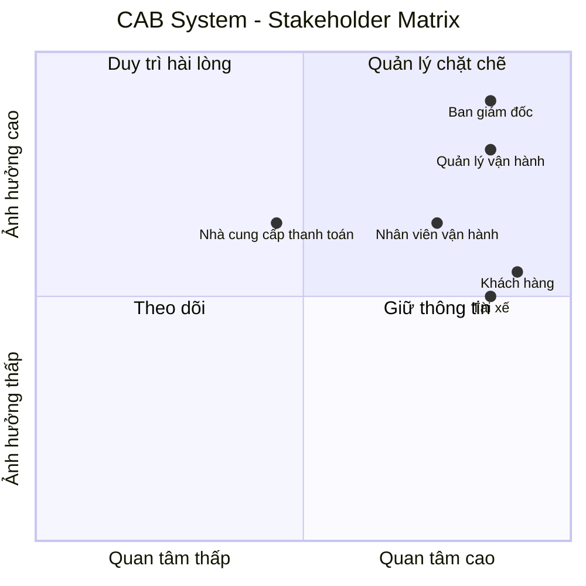
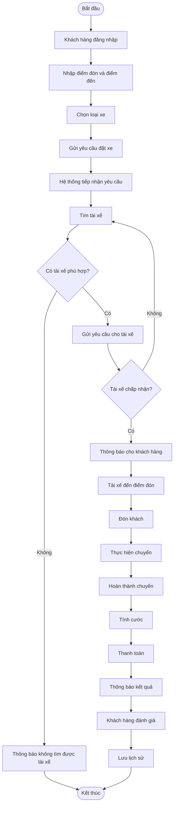
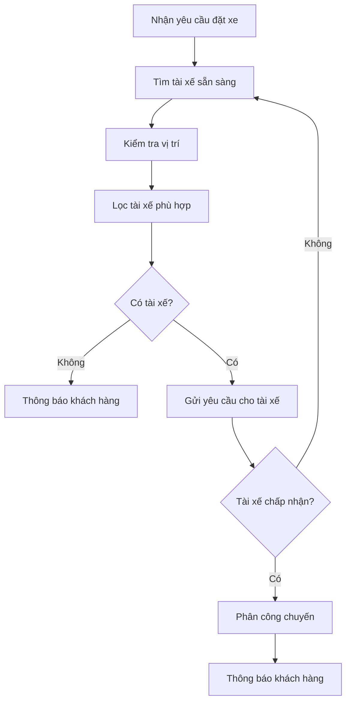

# SRS – CAB System

## Dự án xây dựng hệ thống CAB System – Nền tảng đặt xe

**Thời gian xây dựng:** 7 tuần

---

# 1. Phân tích yêu cầu sơ khởi của khách hàng

## 1.1. Bối cảnh

Công ty ABC cung cấp dịch vụ đặt xe trực tuyến. Hiện tại khách hàng có thể liên hệ tổng đài hoặc sử dụng một ứng dụng đơn giản để yêu cầu xe.

Tuy nhiên, hệ thống hiện tại còn một số hạn chế:

- Việc phân công tài xế chủ yếu được thực hiện thủ công.
- Khách hàng khó theo dõi trạng thái chuyến đi.
- Thông tin thanh toán chưa được quản lý tập trung.
- Bộ phận vận hành gặp khó khăn khi quản lý số lượng lớn khách hàng và tài xế.
- Hệ thống khó mở rộng thêm các chức năng mới.

Do đó, công ty ABC mong muốn xây dựng một hệ thống CAB System mới có khả năng hỗ trợ khách hàng, tài xế và nhân viên vận hành.

## 1.2. Các nhu cầu chính

### Khách hàng

Khách hàng cần có thể:

- Đăng ký tài khoản.
- Đăng nhập.
- Cập nhật thông tin cá nhân.
- Nhập điểm đón và điểm đến.
- Chọn loại xe.
- Đặt chuyến.
- Theo dõi trạng thái chuyến.
- Xem thông tin tài xế.
- Xem lịch sử chuyến đi.
- Thanh toán.
- Đánh giá tài xế.

### Tài xế

Tài xế cần có thể:

- Đăng nhập.
- Cập nhật hồ sơ.
- Quản lý thông tin phương tiện.
- Chuyển trạng thái sẵn sàng nhận chuyến.
- Nhận thông báo chuyến mới.
- Chấp nhận hoặc từ chối chuyến.
- Cập nhật trạng thái chuyến.
- Cập nhật vị trí.

### Nhân viên vận hành

Nhân viên vận hành cần có thể:

- Quản lý khách hàng.
- Quản lý tài xế.
- Quản lý phương tiện.
- Theo dõi chuyến đi.
- Xử lý các chuyến gặp vấn đề.
- Tra cứu giao dịch.
- Xem báo cáo.

## 1.3. Các vấn đề cần làm rõ

Một số thông tin khách hàng chưa xác định cụ thể:

- Cách tính cước.
- Tiêu chí ưu tiên tài xế.
- Thời gian tài xế phải phản hồi.
- Chính sách hủy chuyến.
- Cách xử lý khi mất kết nối.
- Thời gian lưu trữ dữ liệu.
- Chính sách xử lý thanh toán thất bại.

Các nội dung này cần được trao đổi và xác nhận với khách hàng trước khi triển khai chi tiết.

---

# 2. Stakeholder

## 2.1. Danh sách Stakeholder

Stakeholder là những cá nhân hoặc nhóm có liên quan hoặc bị ảnh hưởng bởi hệ thống CAB.

| Stakeholder | Vai trò |
|---|---|
| Khách hàng | Sử dụng hệ thống để đặt xe, theo dõi chuyến, thanh toán và đánh giá tài xế. |
| Tài xế | Nhận chuyến, thực hiện chuyến và cập nhật trạng thái chuyến. |
| Nhân viên vận hành | Theo dõi và quản lý hoạt động của hệ thống. |
| Quản lý vận hành | Quản lý hoạt động tài xế, chuyến đi và xử lý sự cố. |
| Ban giám đốc | Đưa ra mục tiêu kinh doanh và theo dõi hiệu quả hoạt động. |
| Nhà cung cấp thanh toán | Xử lý các giao dịch thanh toán điện tử. |
| Nhà cung cấp thông báo | Hỗ trợ gửi thông báo đến khách hàng và tài xế. |
| Nhóm phát triển hệ thống | Phân tích, xây dựng, kiểm thử và bảo trì hệ thống. |

## 2.2. Stakeholder Matrix

Ma trận Stakeholder sử dụng hai tiêu chí:

- Mức độ ảnh hưởng (Power).
- Mức độ quan tâm (Interest).



---

# 3. Business Goal – Mục tiêu nghiệp vụ

Business Goal là những mục tiêu mà doanh nghiệp muốn đạt được khi xây dựng CAB System.

| Mã | Business Goal | Diễn giải |
|---|---|---|
| BG01 | Tự động tìm và phân công tài xế | Giảm việc phân công tài xế thủ công và nâng cao hiệu quả đặt xe. |
| BG02 | Hỗ trợ thanh toán | Cho phép khách hàng thanh toán bằng tiền mặt hoặc thanh toán điện tử. |
| BG03 | Cải thiện trải nghiệm khách hàng | Cho phép khách hàng đặt xe, theo dõi chuyến và nhận thông báo. |
| BG04 | Quản lý tập trung | Quản lý khách hàng, tài xế, phương tiện, chuyến đi và giao dịch. |
| BG05 | Nâng cao hiệu quả vận hành | Giúp nhân viên vận hành theo dõi và xử lý hoạt động của hệ thống. |
| BG06 | Cung cấp báo cáo | Cung cấp dữ liệu về chuyến đi, doanh thu và hiệu quả hoạt động. |
| BG07 | Đảm bảo an toàn và bảo mật | Bảo vệ tài khoản, thông tin cá nhân, dữ liệu giao dịch và các thao tác quản trị. |
| BG08 | Hỗ trợ mở rộng | Cho phép hệ thống có thể bổ sung chức năng và dịch vụ mới trong tương lai. |

### Ví dụ

```text
BG01 – Tự động tìm và phân công tài xế

Doanh nghiệp muốn:
→ Hệ thống tự động tìm tài xế phù hợp
→ Không phải phân công thủ công
→ Nếu tài xế từ chối thì tìm tài xế khác
```

---

# 4. Scope – Phạm vi hệ thống

## 4.1. Phạm vi thực hiện

Trong phạm vi dự án CAB System, hệ thống tập trung vào các chức năng chính:

| STT | Phạm vi |
|---|---|
| 1 | Quản lý khách hàng |
| 2 | Quản lý tài xế |
| 3 | Quản lý phương tiện |
| 4 | Đặt chuyến xe |
| 5 | Tìm và phân công tài xế |
| 6 | Theo dõi chuyến đi |
| 7 | Cập nhật trạng thái chuyến |
| 8 | Tính cước |
| 9 | Thanh toán |
| 10 | Gửi thông báo |
| 11 | Đánh giá tài xế |
| 12 | Quản lý vận hành |
| 13 | Tra cứu giao dịch |
| 14 | Báo cáo |
| 15 | Phân quyền người dùng |
| 16 | Ghi nhận lịch sử thao tác |

## 4.2. Ngoài phạm vi

Các chức năng sau chưa nằm trong phạm vi cơ bản của dự án:

- Xây dựng hệ thống bản đồ riêng.
- Xây dựng hệ thống thanh toán riêng.
- Xây dựng phương tiện vận chuyển.
- Quản lý bảo dưỡng xe chuyên sâu.
- Quản lý lương tài xế.
- Hệ thống quảng cáo.
- Các dịch vụ ngoài hoạt động đặt xe.

Các chức năng này có thể được xem xét trong tương lai nếu doanh nghiệp có nhu cầu.

## 4.3. Xác nhận phạm vi

Trước khi phát triển hệ thống, Business Analyst cần trao đổi với khách hàng để xác nhận:

- Phạm vi thực hiện.
- Phạm vi không thực hiện.
- Các chức năng ưu tiên.
- Các yêu cầu còn chưa rõ.

---

# 5. Business Requirement – Yêu cầu nghiệp vụ

Sau khi xác nhận với khách hàng, các nhu cầu được chuyển thành Business Requirement.

Business Requirement mô tả những nghiệp vụ mà hệ thống cần hỗ trợ.

## 5.1. Danh sách Business Requirement

| Mã | Tên | Diễn giải |
|---|---|---|
| BR01 | Đặt chuyến xe | Hệ thống cho phép khách hàng tạo yêu cầu đặt xe. |
| BR02 | Quản lý khách hàng | Hệ thống hỗ trợ đăng ký, đăng nhập và quản lý thông tin khách hàng. |
| BR03 | Quản lý tài xế | Hệ thống hỗ trợ quản lý tài khoản và trạng thái tài xế. |
| BR04 | Quản lý phương tiện | Hệ thống hỗ trợ quản lý thông tin phương tiện. |
| BR05 | Tìm tài xế | Hệ thống tự động tìm tài xế phù hợp cho chuyến đi. |
| BR06 | Phân công tài xế | Hệ thống gửi yêu cầu chuyến cho tài xế và xử lý kết quả phản hồi. |
| BR07 | Theo dõi chuyến | Khách hàng có thể theo dõi trạng thái chuyến đi. |
| BR08 | Thực hiện chuyến | Tài xế có thể cập nhật trạng thái trong quá trình thực hiện chuyến. |
| BR09 | Quản lý vị trí | Hệ thống ghi nhận vị trí của tài xế. |
| BR10 | Tính cước | Hệ thống xác định số tiền khách hàng phải thanh toán. |
| BR11 | Thanh toán | Hệ thống hỗ trợ thanh toán tiền mặt và thanh toán điện tử. |
| BR12 | Xử lý thanh toán lỗi | Hệ thống xử lý trường hợp thanh toán điện tử thất bại. |
| BR13 | Thông báo | Hệ thống gửi thông báo cho khách hàng và tài xế. |
| BR14 | Đánh giá tài xế | Khách hàng có thể đánh giá tài xế sau chuyến đi. |
| BR15 | Quản lý vận hành | Nhân viên vận hành quản lý khách hàng, tài xế và chuyến đi. |
| BR16 | Xử lý sự cố | Nhân viên vận hành có thể hỗ trợ xử lý chuyến gặp vấn đề. |
| BR17 | Quản lý giao dịch | Hệ thống hỗ trợ tra cứu lịch sử giao dịch. |
| BR18 | Phân quyền | Hệ thống kiểm soát quyền truy cập của người dùng. |
| BR19 | Báo cáo | Hệ thống cung cấp báo cáo hoạt động. |
| BR20 | Ghi nhận thao tác | Hệ thống lưu lại các thao tác quan trọng. |

## 5.2. Liên kết Business Goal và Business Requirement

| Business Goal | Business Requirement |
|---|---|
| BG01 | BR05, BR06 |
| BG02 | BR10, BR11, BR12 |
| BG03 | BR01, BR07, BR13, BR14 |
| BG04 | BR02, BR03, BR04, BR17 |
| BG05 | BR15, BR16 |
| BG06 | BR17, BR19 |
| BG07 | BR18, BR20 |
| BG08 | Các yêu cầu kiến trúc và thiết kế ở giai đoạn sau |

---

# 6. Business Process – Quy trình nghiệp vụ

## 6.1. Quy trình đặt xe tổng quát

Quy trình chính của CAB System:

1. Khách hàng đăng nhập.
2. Khách hàng nhập điểm đón và điểm đến.
3. Khách hàng chọn loại xe.
4. Khách hàng gửi yêu cầu đặt xe.
5. Hệ thống tiếp nhận yêu cầu.
6. Hệ thống tìm tài xế.
7. Hệ thống gửi yêu cầu cho tài xế.
8. Tài xế chấp nhận hoặc từ chối.
9. Nếu tài xế từ chối, hệ thống tìm tài xế khác.
10. Nếu tìm được tài xế, hệ thống thông báo cho khách hàng.
11. Tài xế đến điểm đón.
12. Tài xế đón khách.
13. Tài xế thực hiện chuyến.
14. Tài xế hoàn thành chuyến.
15. Hệ thống tính cước.
16. Khách hàng thanh toán.
17. Hệ thống thông báo kết quả.
18. Khách hàng đánh giá tài xế.
19. Hệ thống lưu lịch sử.

## 6.2. Business Process Diagram



## 6.3. Các Business Process chính

| Mã | Business Process | Mô tả |
|---|---|---|
| BP01 | Quản lý khách hàng | Đăng ký, đăng nhập và cập nhật thông tin. |
| BP02 | Đặt chuyến | Khách hàng tạo yêu cầu đặt xe. |
| BP03 | Tìm tài xế | Hệ thống tìm tài xế phù hợp. |
| BP04 | Phân công tài xế | Tài xế nhận hoặc từ chối chuyến. |
| BP05 | Thực hiện chuyến | Tài xế thực hiện và cập nhật trạng thái chuyến. |
| BP06 | Tính cước | Hệ thống tính số tiền cần thanh toán. |
| BP07 | Thanh toán | Khách hàng thanh toán chuyến đi. |
| BP08 | Thông báo | Hệ thống gửi thông báo. |
| BP09 | Đánh giá | Khách hàng đánh giá tài xế. |
| BP10 | Quản lý vận hành | Nhân viên vận hành theo dõi và xử lý hoạt động. |

## 6.4. Quy trình tìm tài xế



> Tiêu chí ưu tiên tài xế và thời gian phản hồi cần được khách hàng xác nhận.

---

# 7. Functional Requirements – Yêu cầu chức năng

Functional Requirement là các chức năng cụ thể mà hệ thống phải thực hiện để đáp ứng Business Requirement.

## 7.1. Phân rã Business Requirement thành Functional Requirement

### BR01 – Đặt chuyến xe

| Mã | Functional Requirement | Diễn giải |
|---|---|---|
| FR01.01 | Nhập điểm đón | Hệ thống cho phép khách hàng nhập điểm đón. |
| FR01.02 | Nhập điểm đến | Hệ thống cho phép khách hàng nhập điểm đến. |
| FR01.03 | Chọn loại xe | Hệ thống cho phép khách hàng chọn loại xe. |
| FR01.04 | Gửi yêu cầu | Hệ thống cho phép khách hàng gửi yêu cầu đặt xe. |
| FR01.05 | Kiểm tra yêu cầu | Hệ thống kiểm tra thông tin trước khi tạo chuyến. |
| FR01.06 | Tạo chuyến | Hệ thống tạo và lưu thông tin chuyến. |

### BR02 – Quản lý khách hàng

| Mã | Functional Requirement | Diễn giải |
|---|---|---|
| FR02.01 | Đăng ký | Khách hàng có thể tạo tài khoản. |
| FR02.02 | Đăng nhập | Khách hàng có thể đăng nhập. |
| FR02.03 | Cập nhật thông tin | Khách hàng có thể cập nhật thông tin cá nhân. |

### BR03 – Quản lý tài xế

| Mã | Functional Requirement | Diễn giải |
|---|---|---|
| FR03.01 | Quản lý hồ sơ | Hệ thống lưu thông tin tài xế. |
| FR03.02 | Cập nhật trạng thái | Tài xế có thể chuyển trạng thái sẵn sàng hoặc không sẵn sàng. |
| FR03.03 | Quản lý tài khoản | Hệ thống hỗ trợ quản lý tài khoản tài xế. |

### BR04 – Quản lý phương tiện

| Mã | Functional Requirement | Diễn giải |
|---|---|---|
| FR04.01 | Thêm phương tiện | Hệ thống cho phép thêm thông tin phương tiện. |
| FR04.02 | Cập nhật phương tiện | Hệ thống cho phép cập nhật thông tin phương tiện. |

### BR05 – Tìm tài xế

| Mã | Functional Requirement | Diễn giải |
|---|---|---|
| FR05.01 | Tìm tài xế sẵn sàng | Hệ thống tìm tài xế đang sẵn sàng. |
| FR05.02 | Kiểm tra vị trí | Hệ thống kiểm tra vị trí tài xế. |
| FR05.03 | Lọc tài xế | Hệ thống lọc tài xế phù hợp. |
| FR05.04 | Ưu tiên tài xế | Hệ thống ưu tiên tài xế theo tiêu chí được xác nhận. |

### BR06 – Phân công tài xế

| Mã | Functional Requirement | Diễn giải |
|---|---|---|
| FR06.01 | Gửi yêu cầu | Hệ thống gửi yêu cầu chuyến cho tài xế. |
| FR06.02 | Chấp nhận chuyến | Hệ thống ghi nhận tài xế chấp nhận. |
| FR06.03 | Từ chối chuyến | Hệ thống ghi nhận tài xế từ chối. |
| FR06.04 | Xử lý không phản hồi | Hệ thống xử lý khi tài xế không phản hồi. |
| FR06.05 | Tìm tài xế khác | Hệ thống tiếp tục tìm tài xế khác. |
| FR06.06 | Thông báo thất bại | Hệ thống thông báo khách hàng nếu không tìm được tài xế. |

### BR07 – Theo dõi chuyến

| Mã | Functional Requirement | Diễn giải |
|---|---|---|
| FR07.01 | Xem trạng thái | Khách hàng xem được trạng thái chuyến. |
| FR07.02 | Xem tài xế | Khách hàng xem được thông tin tài xế. |
| FR07.03 | Theo dõi vị trí | Khách hàng có thể theo dõi vị trí tài xế theo khả năng hệ thống. |

### BR08 – Thực hiện chuyến

| Mã | Functional Requirement | Diễn giải |
|---|---|---|
| FR08.01 | Đã đến điểm đón | Tài xế cập nhật đã đến. |
| FR08.02 | Đã đón khách | Tài xế cập nhật đã đón khách. |
| FR08.03 | Đang di chuyển | Tài xế cập nhật đang di chuyển. |
| FR08.04 | Hoàn thành | Tài xế cập nhật hoàn thành chuyến. |

### BR09 – Quản lý vị trí

| Mã | Functional Requirement | Diễn giải |
|---|---|---|
| FR09.01 | Ghi nhận vị trí | Hệ thống ghi nhận vị trí tài xế. |
| FR09.02 | Cập nhật vị trí | Hệ thống cập nhật vị trí tài xế. |

### BR10 – Tính cước

| Mã | Functional Requirement | Diễn giải |
|---|---|---|
| FR10.01 | Tính cước | Hệ thống tính số tiền cần thanh toán. |
| FR10.02 | Xác định dịch vụ | Hệ thống xác định loại dịch vụ của chuyến. |
| FR10.03 | Lưu cước | Hệ thống lưu thông tin cước. |

### BR11 – Thanh toán

| Mã | Functional Requirement | Diễn giải |
|---|---|---|
| FR11.01 | Chọn phương thức | Khách hàng chọn phương thức thanh toán. |
| FR11.02 | Tiền mặt | Hệ thống hỗ trợ thanh toán tiền mặt. |
| FR11.03 | Thanh toán điện tử | Hệ thống hỗ trợ thanh toán điện tử. |
| FR11.04 | Nhận kết quả | Hệ thống nhận kết quả thanh toán. |

### BR12 – Xử lý thanh toán lỗi

| Mã | Functional Requirement | Diễn giải |
|---|---|---|
| FR12.01 | Ghi nhận lỗi | Hệ thống ghi nhận thanh toán thất bại. |
| FR12.02 | Thông báo lỗi | Hệ thống thông báo cho khách hàng. |
| FR12.03 | Thanh toán lại | Hệ thống hỗ trợ xử lý lại theo chính sách. |

### BR13 – Thông báo

| Mã | Functional Requirement | Diễn giải |
|---|---|---|
| FR13.01 | Thông báo đặt xe | Thông báo khi yêu cầu được tiếp nhận. |
| FR13.02 | Thông báo nhận chuyến | Thông báo khi tài xế nhận chuyến. |
| FR13.03 | Thông báo đến điểm đón | Thông báo khi tài xế đến. |
| FR13.04 | Thông báo hoàn thành | Thông báo khi chuyến hoàn thành. |
| FR13.05 | Thông báo thanh toán | Thông báo kết quả thanh toán. |

### BR14 – Đánh giá tài xế

| Mã | Functional Requirement | Diễn giải |
|---|---|---|
| FR14.01 | Đánh giá tài xế | Khách hàng có thể đánh giá tài xế. |
| FR14.02 | Lưu đánh giá | Hệ thống lưu đánh giá. |

### BR15 – Quản lý vận hành

| Mã | Functional Requirement | Diễn giải |
|---|---|---|
| FR15.01 | Quản lý khách hàng | Nhân viên có thể quản lý khách hàng. |
| FR15.02 | Quản lý tài xế | Nhân viên có thể quản lý tài xế. |
| FR15.03 | Quản lý phương tiện | Nhân viên có thể quản lý phương tiện. |
| FR15.04 | Theo dõi chuyến | Nhân viên có thể theo dõi chuyến đang diễn ra. |

### BR16 – Xử lý sự cố

| Mã | Functional Requirement | Diễn giải |
|---|---|---|
| FR16.01 | Xem chuyến lỗi | Nhân viên xem được chuyến gặp vấn đề. |
| FR16.02 | Xử lý chuyến lỗi | Nhân viên hỗ trợ xử lý theo quyền được cấp. |

### BR17 – Quản lý giao dịch

| Mã | Functional Requirement | Diễn giải |
|---|---|---|
| FR17.01 | Tra cứu giao dịch | Nhân viên có quyền có thể tra cứu giao dịch. |
| FR17.02 | Xem trạng thái | Hệ thống hiển thị trạng thái giao dịch. |

### BR18 – Phân quyền

| Mã | Functional Requirement | Diễn giải |
|---|---|---|
| FR18.01 | Xác thực | Hệ thống xác thực người dùng. |
| FR18.02 | Phân quyền | Hệ thống kiểm soát quyền theo vai trò. |
| FR18.03 | Kiểm soát quản trị | Hệ thống hạn chế thao tác nhạy cảm. |

### BR19 – Báo cáo

| Mã | Functional Requirement | Diễn giải |
|---|---|---|
| FR19.01 | Báo cáo chuyến | Thống kê số lượng chuyến. |
| FR19.02 | Báo cáo doanh thu | Thống kê doanh thu. |
| FR19.03 | Báo cáo hoàn thành | Thống kê tỷ lệ hoàn thành. |
| FR19.04 | Báo cáo hủy | Thống kê tỷ lệ hủy. |
| FR19.05 | Báo cáo tài xế | Thống kê hiệu quả tài xế. |

### BR20 – Ghi nhận thao tác

| Mã | Functional Requirement | Diễn giải |
|---|---|---|
| FR20.01 | Ghi log | Hệ thống ghi nhận các thao tác quan trọng. |
| FR20.02 | Tra cứu log | Người có quyền có thể tra cứu lịch sử thao tác. |

---

# 8. Traceability – Liên kết BR và FR

Bảng này dùng để kiểm tra xem các Business Requirement đã được phân rã thành Functional Requirement hay chưa.

| Business Requirement | Functional Requirement |
|---|---|
| BR01 | FR01.01 – FR01.06 |
| BR02 | FR02.01 – FR02.03 |
| BR03 | FR03.01 – FR03.03 |
| BR04 | FR04.01 – FR04.02 |
| BR05 | FR05.01 – FR05.04 |
| BR06 | FR06.01 – FR06.06 |
| BR07 | FR07.01 – FR07.03 |
| BR08 | FR08.01 – FR08.04 |
| BR09 | FR09.01 – FR09.02 |
| BR10 | FR10.01 – FR10.03 |
| BR11 | FR11.01 – FR11.04 |
| BR12 | FR12.01 – FR12.03 |
| BR13 | FR13.01 – FR13.05 |
| BR14 | FR14.01 – FR14.02 |
| BR15 | FR15.01 – FR15.04 |
| BR16 | FR16.01 – FR16.02 |
| BR17 | FR17.01 – FR17.02 |
| BR18 | FR18.01 – FR18.03 |
| BR19 | FR19.01 – FR19.05 |
| BR20 | FR20.01 – FR20.02 |

---

# 9. Các yêu cầu cần xác nhận với khách hàng

Một số nội dung chưa đủ thông tin để xác định chi tiết và cần được khách hàng xác nhận:

| STT | Nội dung cần xác nhận |
|---|---|
| 1 | Công thức tính cước. |
| 2 | Tiêu chí ưu tiên tài xế. |
| 3 | Thời gian tài xế phải phản hồi. |
| 4 | Số lần tìm tài xế lại. |
| 5 | Chính sách hủy chuyến. |
| 6 | Chính sách thanh toán thất bại. |
| 7 | Thời gian lưu trữ dữ liệu. |
| 8 | Tần suất cập nhật vị trí tài xế. |
| 9 | Các kênh thông báo sẽ sử dụng. |
| 10 | Quyền hạn cụ thể của từng loại nhân viên vận hành. |

---
# 8. Business Rules và Business Exceptions

## 8.1. Business Rules – Quy tắc nghiệp vụ

Business Rule là những quy tắc mà hệ thống phải tuân thủ trong quá trình xử lý nghiệp vụ.

Đối với CAB System, các quy tắc nghiệp vụ cơ bản gồm:

| Mã | Business Rule | Diễn giải |
|---|---|---|
| BRULE01 | Khách hàng phải đăng nhập | Khách hàng phải đăng nhập trước khi đặt chuyến. |
| BRULE02 | Tài xế phải ở trạng thái sẵn sàng | Chỉ tài xế đang sẵn sàng mới được hệ thống tìm và phân công chuyến. |
| BRULE03 | Một chuyến chỉ có một tài xế | Một chuyến xe chỉ được phân công cho một tài xế tại một thời điểm. |
| BRULE04 | Tài xế có quyền nhận hoặc từ chối | Tài xế có thể chấp nhận hoặc từ chối yêu cầu chuyến. |
| BRULE05 | Tự động tìm tài xế khác | Nếu tài xế từ chối hoặc không phản hồi, hệ thống tiếp tục tìm tài xế khác. |
| BRULE06 | Không tìm được tài xế | Nếu không có tài xế phù hợp, hệ thống phải thông báo cho khách hàng. |
| BRULE07 | Chỉ được đánh giá sau chuyến | Khách hàng chỉ được đánh giá tài xế sau khi chuyến hoàn thành. |
| BRULE08 | Tính cước sau khi hoàn thành | Hệ thống xác định số tiền phải trả khi chuyến hoàn thành. |
| BRULE09 | Hỗ trợ nhiều phương thức thanh toán | Khách hàng có thể thanh toán bằng tiền mặt hoặc thanh toán điện tử. |
| BRULE10 | Không lưu thông tin thẻ nhạy cảm | Hệ thống CAB không lưu trực tiếp thông tin nhạy cảm của thẻ hoặc tài khoản thanh toán. |
| BRULE11 | Chỉ người có quyền mới được quản trị | Nhân viên chỉ được thực hiện các chức năng phù hợp với quyền được cấp. |
| BRULE12 | Lưu lịch sử chuyến | Các chuyến đã thực hiện phải được lưu để tra cứu. |
| BRULE13 | Ghi nhận thao tác quan trọng | Các thao tác quản trị quan trọng phải được ghi log. |
| BRULE14 | Tài xế phải có phương tiện | Tài xế muốn nhận chuyến phải có phương tiện hợp lệ được quản lý trong hệ thống. |
| BRULE15 | Trạng thái chuyến phải hợp lệ | Chuyến xe phải chuyển trạng thái theo đúng quy trình nghiệp vụ. |

---

## 8.2. Trạng thái chuyến xe

Một chuyến xe có thể có các trạng thái cơ bản:

```text
REQUESTED
    ↓
SEARCHING_DRIVER
    ↓
DRIVER_ASSIGNED
    ↓
DRIVER_ARRIVING
    ↓
DRIVER_ARRIVED
    ↓
PASSENGER_PICKED_UP
    ↓
IN_PROGRESS
    ↓
COMPLETED

Bước 10: Thiết kế danh sách Non-Functional Requirements

---

# 10. Non-Functional Requirements – Yêu cầu phi chức năng

## 10.1. Khái niệm

Non-Functional Requirement (NFR) là các yêu cầu mô tả cách hệ thống phải hoạt động và chất lượng mà hệ thống cần đáp ứng.

Functional Requirement trả lời câu hỏi:

> Hệ thống phải làm gì?

Non-Functional Requirement trả lời câu hỏi:

> Hệ thống phải hoạt động như thế nào?

Ví dụ:

- FR: Hệ thống cho phép khách hàng đặt xe.
- NFR: Hệ thống phải phản hồi yêu cầu đặt xe trong thời gian hợp lý.

---

## 10.2. Danh sách Non-Functional Requirements

| Mã | Nhóm | Tên yêu cầu | Diễn giải |
|---|---|---|---|
| NFR01 | Performance | Hiệu năng | Hệ thống phải phản hồi nhanh đối với các thao tác thông thường. |
| NFR02 | Performance | Xử lý đồng thời | Hệ thống phải hỗ trợ nhiều khách hàng và tài xế sử dụng cùng lúc. |
| NFR03 | Availability | Tính sẵn sàng | Hệ thống phải hoạt động ổn định trong thời gian cung cấp dịch vụ. |
| NFR04 | Scalability | Khả năng mở rộng | Hệ thống phải có khả năng mở rộng khi số lượng người dùng và chuyến xe tăng. |
| NFR05 | Security | Xác thực | Người dùng phải được xác thực trước khi sử dụng các chức năng yêu cầu tài khoản. |
| NFR06 | Security | Phân quyền | Người dùng chỉ được sử dụng các chức năng phù hợp với quyền của mình. |
| NFR07 | Security | Bảo vệ dữ liệu | Thông tin cá nhân, thông tin tài xế, dữ liệu vị trí và giao dịch phải được bảo vệ. |
| NFR08 | Security | Bảo vệ mật khẩu | Mật khẩu không được lưu trực tiếp dưới dạng rõ. |
| NFR09 | Security | Audit Log | Các thao tác quan trọng phải được ghi nhận để phục vụ kiểm tra. |
| NFR10 | Reliability | Độ tin cậy | Lỗi ở thanh toán hoặc thông báo không được làm dừng toàn bộ hệ thống đặt xe. |
| NFR11 | Recovery | Khả năng phục hồi | Hệ thống cần có khả năng phục hồi sau khi xảy ra lỗi hoặc sự cố. |
| NFR12 | Maintainability | Khả năng bảo trì | Hệ thống phải dễ sửa lỗi, bảo trì và nâng cấp. |
| NFR13 | Extensibility | Khả năng mở rộng chức năng | Hệ thống có thể bổ sung dịch vụ, phương thức thanh toán và kênh thông báo mới. |
| NFR14 | Usability | Dễ sử dụng | Giao diện phải đơn giản và dễ sử dụng đối với khách hàng, tài xế và nhân viên. |
| NFR15 | Backup | Sao lưu dữ liệu | Dữ liệu quan trọng cần được sao lưu để hạn chế mất dữ liệu. |
| NFR16 | Monitoring | Giám sát | Hệ thống cần có khả năng theo dõi trạng thái và phát hiện lỗi. |
| NFR17 | Privacy | Quyền riêng tư | Thông tin cá nhân của khách hàng và tài xế phải được bảo vệ. |

---

## 10.3. Chi tiết các yêu cầu phi chức năng

### NFR01 – Performance

Hệ thống phải có thời gian phản hồi hợp lý đối với các thao tác thông thường như:

- Đăng nhập.
- Tạo yêu cầu đặt xe.
- Xem thông tin chuyến.
- Xem lịch sử chuyến.
- Tra cứu giao dịch.

Trong điều kiện tải bình thường, thời gian phản hồi mục tiêu có thể đặt là:

```text

Bước 11: Xác định và vẽ các Use case.
Bước 12: Viết các đặc tả use case.
